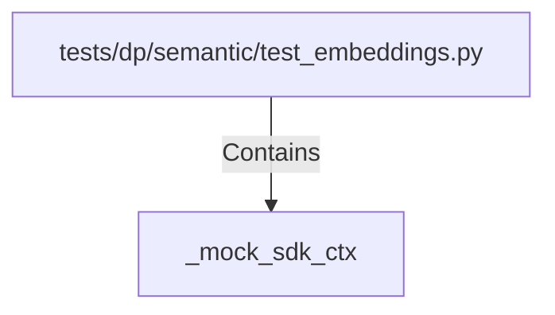

# _mock_sdk_ctx (PythonSymbol)

## Properties

| Key | Value |
|---|---|
| `kind` | function |

## Relationships

### Contains

- ← tests/dp/semantic/test_embeddings.py (`f38bdced-79b6-5ffe-b348-628b531e66dc`)

## Diagram

## Evidence

_No evidence cited._
