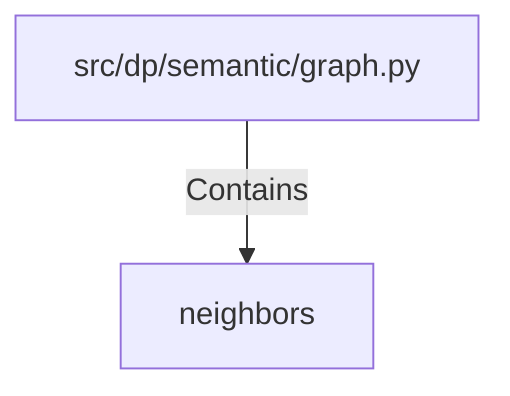

# neighbors (PythonSymbol)

## Properties

| Key | Value |
|---|---|
| `kind` | function |

## Relationships

### Contains

- ← src/dp/semantic/graph.py (`efdc0993-b53b-5997-a832-81d4347f2dd8`)

## Diagram

## Evidence

_No evidence cited._
