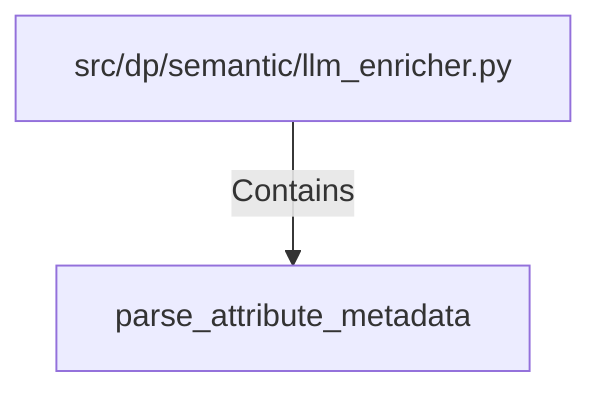

# parse_attribute_metadata (PythonSymbol)

## Properties

| Key | Value |
|---|---|
| `kind` | function |

## Relationships

### Contains

- ← src/dp/semantic/llm_enricher.py (`48cbaf39-e0fa-5dfb-b7f9-3c29241145c1`)

## Diagram

## Evidence

_No evidence cited._
