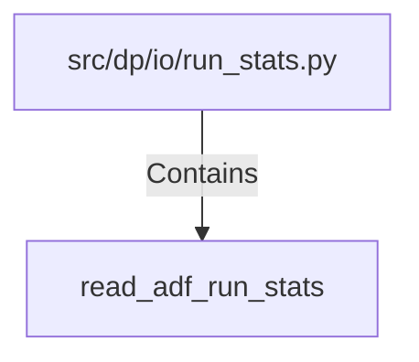

# read_adf_run_stats (PythonSymbol)

## Properties

| Key | Value |
|---|---|
| `kind` | function |

## Relationships

### Contains

- ← src/dp/io/run_stats.py (`b58b935d-2918-5656-97b3-dad504a9e27c`)

## Diagram

## Evidence

_No evidence cited._
