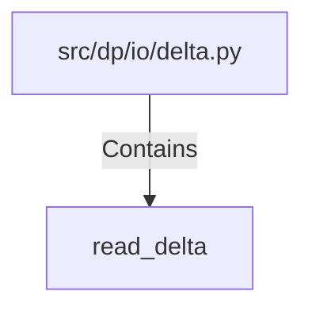

# read_delta (PythonSymbol)

## Properties

| Key | Value |
|---|---|
| `kind` | function |

## Relationships

### Contains

- ← src/dp/io/delta.py (`31c42960-32c1-571b-acd7-a22fcdb34ad7`)

## Diagram

## Evidence

_No evidence cited._
