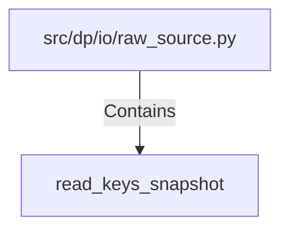

# read_keys_snapshot (PythonSymbol)

## Properties

| Key | Value |
|---|---|
| `kind` | function |

## Relationships

### Contains

- ← src/dp/io/raw_source.py (`35307936-2715-5284-af57-7302a06265d8`)

## Diagram

## Evidence

_No evidence cited._
