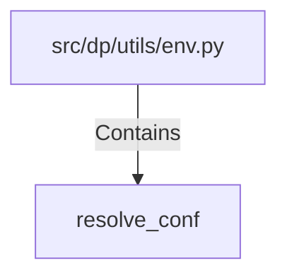

# resolve_conf (PythonSymbol)

## Properties

| Key | Value |
|---|---|
| `kind` | function |

## Relationships

### Contains

- ← src/dp/utils/env.py (`29dd12ec-ab77-545d-b64a-7b7d2529ddcb`)

## Diagram

## Evidence

_No evidence cited._
