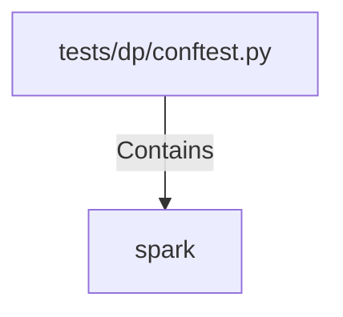

# spark (PythonSymbol)

## Properties

| Key | Value |
|---|---|
| `kind` | function |

## Relationships

### Contains

- ← tests/dp/conftest.py (`720ecee2-4b60-529b-872a-244dd9c837b3`)

## Diagram

## Evidence

_No evidence cited._
