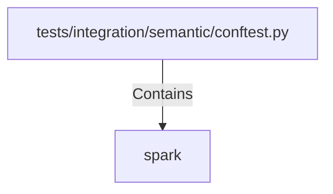

# spark (PythonSymbol)

## Properties

| Key | Value |
|---|---|
| `kind` | function |

## Relationships

### Contains

- ← tests/integration/semantic/conftest.py (`f3bf6620-d61a-56a2-b193-843d3308ae7f`)

## Diagram

## Evidence

_No evidence cited._
