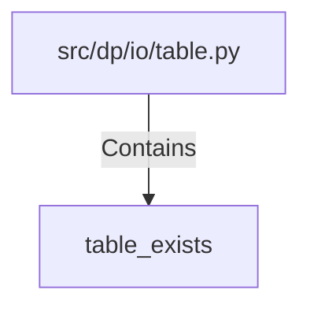

# table_exists (PythonSymbol)

## Properties

| Key | Value |
|---|---|
| `kind` | function |

## Relationships

### Contains

- ← src/dp/io/table.py (`16eb1a72-8fe3-547f-93bc-158d68367ce8`)

## Diagram

## Evidence

_No evidence cited._
