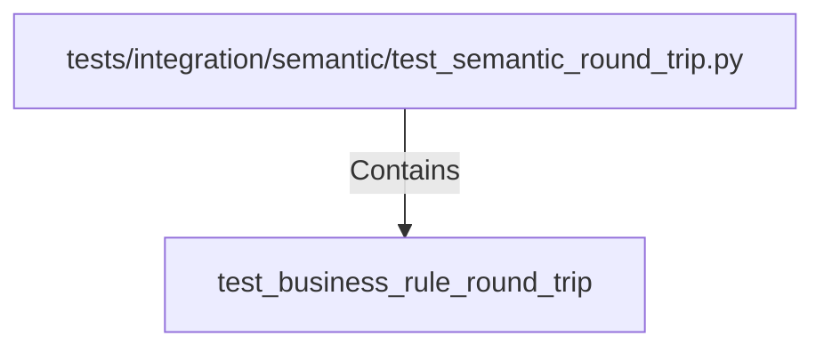

# test_business_rule_round_trip (PythonSymbol)

## Properties

| Key | Value |
|---|---|
| `kind` | function |

## Relationships

### Contains

- ← tests/integration/semantic/test_semantic_round_trip.py (`1467a6cf-5d45-5963-a2f9-46c99a5917d4`)

## Diagram

## Evidence

_No evidence cited._
