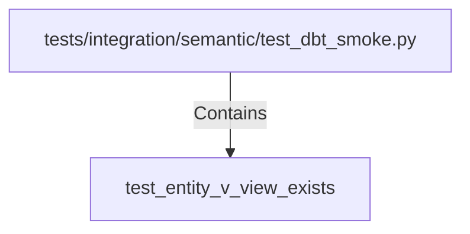

# test_entity_v_view_exists (PythonSymbol)

## Properties

| Key | Value |
|---|---|
| `kind` | function |

## Relationships

### Contains

- ← tests/integration/semantic/test_dbt_smoke.py (`04875f9e-4f89-574f-bad1-540c39d1e88f`)

## Diagram

## Evidence

_No evidence cited._
