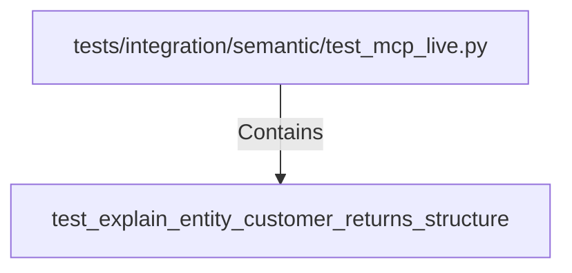

# test_explain_entity_customer_returns_structure (PythonSymbol)

## Properties

| Key | Value |
|---|---|
| `kind` | function |

## Relationships

### Contains

- ← tests/integration/semantic/test_mcp_live.py (`2b2c3f46-1ee2-547b-abd4-4c88f898c363`)

## Diagram

## Evidence

_No evidence cited._
