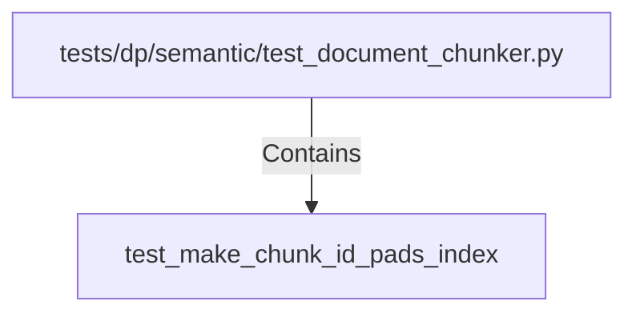

# test_make_chunk_id_pads_index (PythonSymbol)

## Properties

| Key | Value |
|---|---|
| `kind` | function |

## Relationships

### Contains

- ← tests/dp/semantic/test_document_chunker.py (`6ba5d553-ee39-50fb-a5f3-039f8e60b053`)

## Diagram

## Evidence

_No evidence cited._
