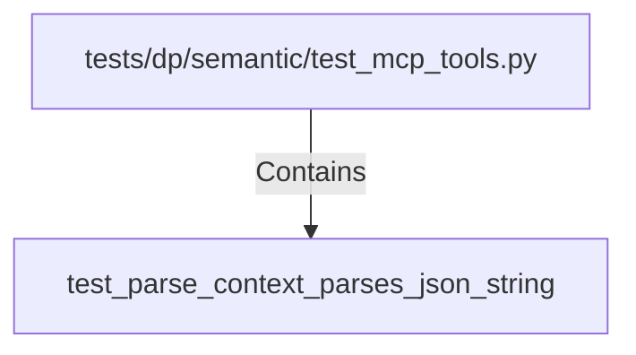

# test_parse_context_parses_json_string (PythonSymbol)

## Properties

| Key | Value |
|---|---|
| `kind` | function |

## Relationships

### Contains

- ← tests/dp/semantic/test_mcp_tools.py (`4f73df62-9377-53aa-a84c-60d87949ad41`)

## Diagram

## Evidence

_No evidence cited._
