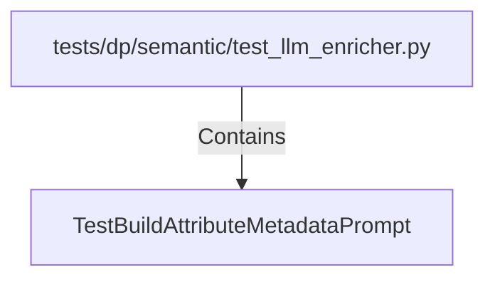

# TestBuildAttributeMetadataPrompt (PythonSymbol)

## Properties

| Key | Value |
|---|---|
| `kind` | class |

## Relationships

### Contains

- ← tests/dp/semantic/test_llm_enricher.py (`4c45abca-060e-5aeb-9f0d-7c5480cad37a`)

## Diagram

## Evidence

_No evidence cited._
