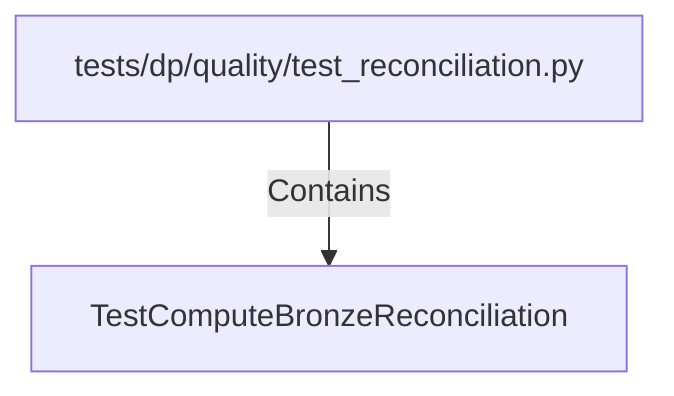

# TestComputeBronzeReconciliation (PythonSymbol)

## Properties

| Key | Value |
|---|---|
| `kind` | class |

## Relationships

### Contains

- ← tests/dp/quality/test_reconciliation.py (`673e3cd1-759a-574a-b0dd-d2216a5c6777`)

## Diagram

## Evidence

_No evidence cited._
