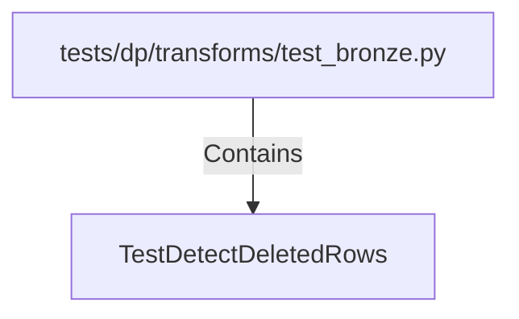

# TestDetectDeletedRows (PythonSymbol)

## Properties

| Key | Value |
|---|---|
| `kind` | class |

## Relationships

### Contains

- ← tests/dp/transforms/test_bronze.py (`81ca72ce-2747-5768-8cc6-a45b22e63c36`)

## Diagram

## Evidence

_No evidence cited._
