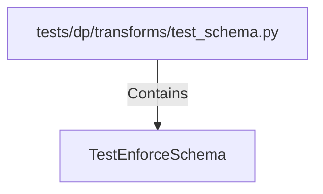

# TestEnforceSchema (PythonSymbol)

## Properties

| Key | Value |
|---|---|
| `kind` | class |

## Relationships

### Contains

- ← tests/dp/transforms/test_schema.py (`7e43ef28-b57c-53b8-868a-a1d14777bade`)

## Diagram

## Evidence

_No evidence cited._
