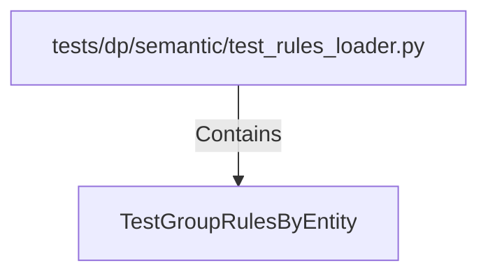

# TestGroupRulesByEntity (PythonSymbol)

## Properties

| Key | Value |
|---|---|
| `kind` | class |

## Relationships

### Contains

- ← tests/dp/semantic/test_rules_loader.py (`11db8d26-0218-542a-9518-c5304931957b`)

## Diagram

## Evidence

_No evidence cited._
