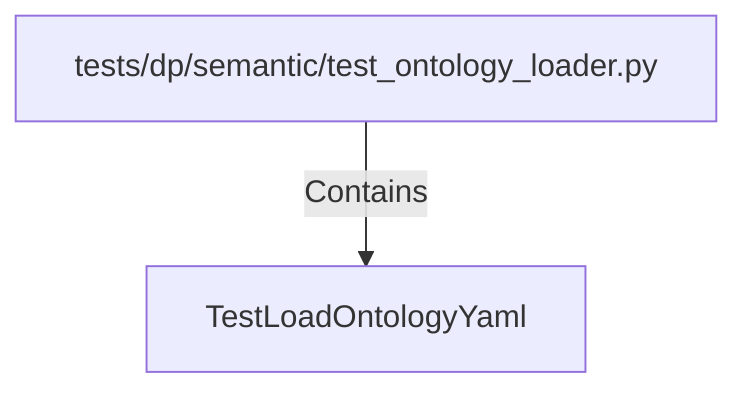

# TestLoadOntologyYaml (PythonSymbol)

## Properties

| Key | Value |
|---|---|
| `kind` | class |

## Relationships

### Contains

- ← tests/dp/semantic/test_ontology_loader.py (`7c2568ce-fb4f-5d12-9f63-74471fff8cd8`)

## Diagram

## Evidence

_No evidence cited._
