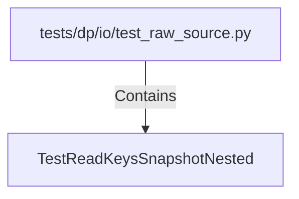

# TestReadKeysSnapshotNested (PythonSymbol)

## Properties

| Key | Value |
|---|---|
| `kind` | class |

## Relationships

### Contains

- ← tests/dp/io/test_raw_source.py (`47ecd9af-36d5-5482-94d3-23c43936edb0`)

## Diagram

## Evidence

_No evidence cited._
