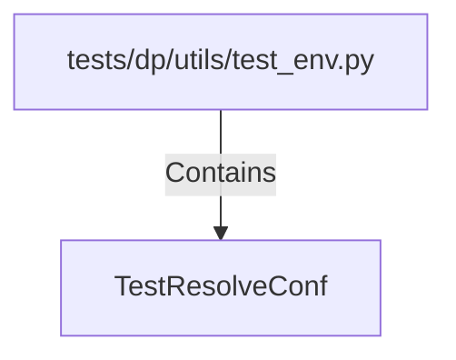

# TestResolveConf (PythonSymbol)

## Properties

| Key | Value |
|---|---|
| `kind` | class |

## Relationships

### Contains

- ← tests/dp/utils/test_env.py (`6f0fbfb8-9af6-58cc-98b9-8e7c8ded75b2`)

## Diagram

## Evidence

_No evidence cited._
