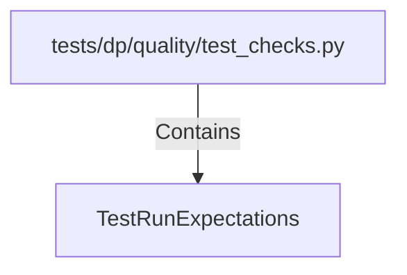

# TestRunExpectations (PythonSymbol)

## Properties

| Key | Value |
|---|---|
| `kind` | class |

## Relationships

### Contains

- ← tests/dp/quality/test_checks.py (`4e1453fe-3b3c-5512-918c-49d80c33798c`)

## Diagram

## Evidence

_No evidence cited._
