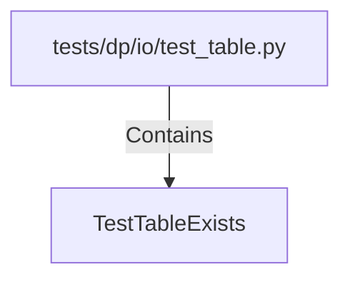

# TestTableExists (PythonSymbol)

## Properties

| Key | Value |
|---|---|
| `kind` | class |

## Relationships

### Contains

- ← tests/dp/io/test_table.py (`b0b83a45-adb2-5046-a53e-cc41e8b8de46`)

## Diagram

## Evidence

_No evidence cited._
