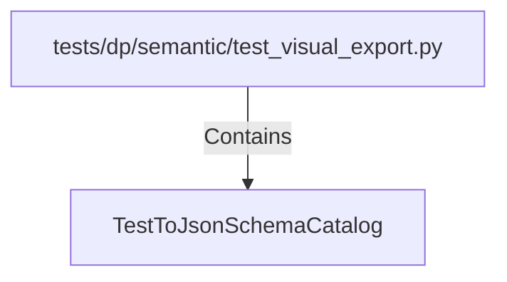

# TestToJsonSchemaCatalog (PythonSymbol)

## Properties

| Key | Value |
|---|---|
| `kind` | class |

## Relationships

### Contains

- ← tests/dp/semantic/test_visual_export.py (`cfab3f85-2d5b-525a-9011-ea372ea9a2c8`)

## Diagram

## Evidence

_No evidence cited._
