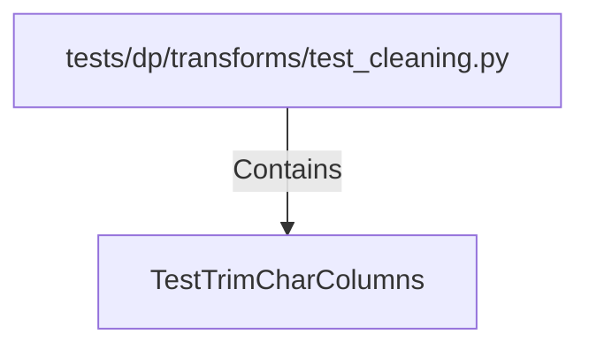

# TestTrimCharColumns (PythonSymbol)

## Properties

| Key | Value |
|---|---|
| `kind` | class |

## Relationships

### Contains

- ← tests/dp/transforms/test_cleaning.py (`1ea83815-b5d0-5a3c-8451-e20cbe130777`)

## Diagram

## Evidence

_No evidence cited._
