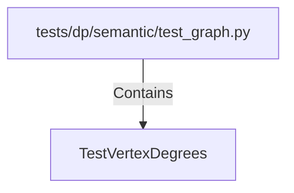

# TestVertexDegrees (PythonSymbol)

## Properties

| Key | Value |
|---|---|
| `kind` | class |

## Relationships

### Contains

- ← tests/dp/semantic/test_graph.py (`fa29a1d3-68a9-50f3-96b9-504f3ccd858e`)

## Diagram

## Evidence

_No evidence cited._
