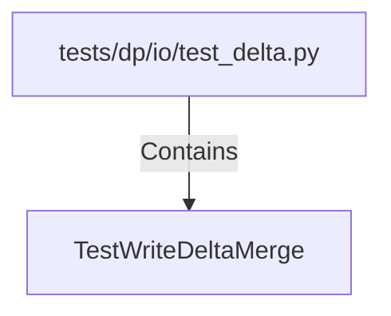

# TestWriteDeltaMerge (PythonSymbol)

## Properties

| Key | Value |
|---|---|
| `kind` | class |

## Relationships

### Contains

- ← tests/dp/io/test_delta.py (`676d69da-cd62-566c-9444-2fc0d29d5716`)

## Diagram

## Evidence

_No evidence cited._
