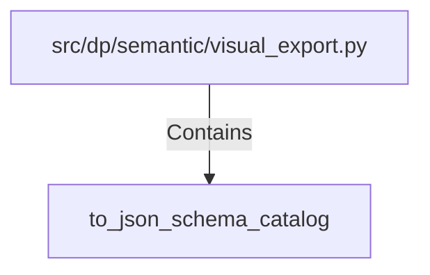

# to_json_schema_catalog (PythonSymbol)

## Properties

| Key | Value |
|---|---|
| `kind` | function |

## Relationships

### Contains

- ← src/dp/semantic/visual_export.py (`21f0a170-901b-56e4-be84-c03f122240f5`)

## Diagram

## Evidence

_No evidence cited._
