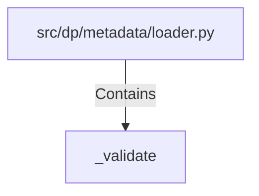

# _validate (PythonSymbol)

## Properties

| Key | Value |
|---|---|
| `kind` | function |

## Relationships

### Contains

- ← src/dp/metadata/loader.py (`b92f5925-3f28-5b8c-9321-0b8eaf210175`)

## Diagram

## Evidence

_No evidence cited._
