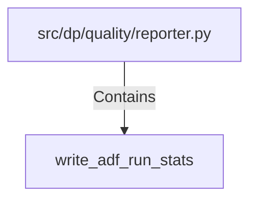

# write_adf_run_stats (PythonSymbol)

## Properties

| Key | Value |
|---|---|
| `kind` | function |

## Relationships

### Contains

- ← src/dp/quality/reporter.py (`380d8a0e-916c-59ea-b799-31bb40f34ed1`)

## Diagram

## Evidence

_No evidence cited._
