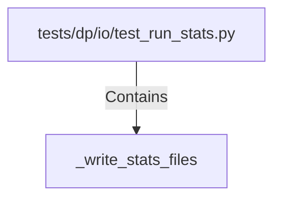

# _write_stats_files (PythonSymbol)

## Properties

| Key | Value |
|---|---|
| `kind` | function |

## Relationships

### Contains

- ← tests/dp/io/test_run_stats.py (`b49dd140-f6f7-5339-8704-7098024220a6`)

## Diagram

## Evidence

_No evidence cited._
