# ekos-artifact (Crate)

## Properties

| Key | Value |
|---|---|
| `description` | Content-addressable artifact types (Phase 2 — stub) |
| `path` | ekos/crates/artifact |

## Relationships

### DependsOn

- ← ekos-benchmark (`20c26e43-ee96-5ee7-a046-25740fbbd56b`) — evidence: ekos-benchmark depends on ekos-artifact (path dependency)
- ← ekos-semantic (`f82d9ce0-df2a-5af8-9f9a-2bd5f8484839`) — evidence: ekos-semantic depends on ekos-artifact (path dependency)
- ← ekos-compiler-core (`2690bc0d-0233-516f-b969-9e87432f623d`) — evidence: ekos-compiler-core depends on ekos-artifact (path dependency)
- ← ekos (`abd31cd9-b31d-54c5-87cd-8a4a5b9a30a0`) — evidence: ekos depends on ekos-artifact (path dependency)
- ← ekos-observation-sdk (`9a955a3a-55bc-587a-942d-fb81d6260052`) — evidence: ekos-observation-sdk depends on ekos-artifact (path dependency)
- → chrono (`0d184cc1-2483-516d-a0b5-0b6bfad54805`) — evidence: ekos-artifact depends on chrono 0.4
- → ekos-common (`dc169f0a-98f1-5c7c-8dd0-1dbc8504e9c9`) — evidence: ekos-artifact depends on ekos-common (path dependency)
- → ekos-kir (`7e3bc0de-d888-55cd-aa9a-f333f6e2cbb2`) — evidence: ekos-artifact depends on ekos-kir (path dependency)
- → hex (`fa785806-31c3-5308-ae4a-2898a2c181ca`) — evidence: ekos-artifact depends on hex 0.4
- → serde_json (`02548eee-6478-5324-851f-3a6329ccfeca`) — evidence: ekos-artifact depends on serde 1
- → sha2 (`64d6fba9-eea7-52e6-9b3a-b2e887a6944f`) — evidence: ekos-artifact depends on sha2 0.10
- → thiserror (`bbefe8a3-f76e-509f-910b-b439cd7eeff6`) — evidence: ekos-artifact depends on thiserror 2
- → tracing (`4282d266-2850-5d04-a992-0f0a204788aa`) — evidence: ekos-artifact depends on tracing 0.1
- → uuid (`ba61f6c0-d160-5eaf-a437-895cee5c72e9`) — evidence: ekos-artifact depends on uuid 1
- → zstd (`3d9eb6f7-8fd9-528a-948f-7ab0cab3e3c5`) — evidence: ekos-artifact depends on zstd 0.13
- ← ekos-recovery (`28244ebb-4e16-5e8d-a637-5e750d01f2b8`) — evidence: ekos-recovery depends on ekos-artifact (path dependency)
- ← ekos-ledger (`9c977335-c421-519c-a889-558f0487574e`) — evidence: ekos-ledger depends on ekos-artifact (path dependency)
- ← ekos-plugin-oracle (`66e4bdc1-07c6-5f6e-9150-d6db731cf29d`) — evidence: ekos-plugin-oracle depends on ekos-artifact (path dependency)
- ← ekos-plugin-confluence (`e8d1a3c9-e7b2-5084-bdfc-569e7b604054`) — evidence: ekos-plugin-confluence depends on ekos-artifact (path dependency)
- ← ekos-plugin-localdocs (`0659fbf3-d2f4-54ba-835f-a7f6f875a7d1`) — evidence: ekos-plugin-localdocs depends on ekos-artifact (path dependency)
- ← ekos-plugin-sap (`870bf8c4-5212-524c-a442-6fe561baf29d`) — evidence: ekos-plugin-sap depends on ekos-artifact (path dependency)
- ← ekos-plugin-github (`aff4d491-b33f-56d7-b0ba-e03e884983fd`) — evidence: ekos-plugin-github depends on ekos-artifact (path dependency)
- ← ekos-plugin-pentaho (`dac1d743-a50e-57a9-8acb-56e29a47ef5e`) — evidence: ekos-plugin-pentaho depends on ekos-artifact (path dependency)
- ← ekos-plugin-file (`06b65958-abb7-5fe1-a6ee-d35946d39062`) — evidence: ekos-plugin-file depends on ekos-artifact (path dependency)
- ← ekos-plugin-python (`020c78ca-f337-542f-b351-8b4201393bbb`) — evidence: ekos-plugin-python depends on ekos-artifact (path dependency)
- ← ekos-plugin-git (`df977fc8-e004-518e-b267-581520ccd448`) — evidence: ekos-plugin-git depends on ekos-artifact (path dependency)
- ← ekos-plugin-fabric (`aeb0688d-1d00-58a5-b6d6-245dfefa74cf`) — evidence: ekos-plugin-fabric depends on ekos-artifact (path dependency)
- ← ekos-plugin-snowflake (`0a005794-329c-5fc3-a395-a5c55cf9cfcb`) — evidence: ekos-plugin-snowflake depends on ekos-artifact (path dependency)
- ← ekos-plugin-salesforce (`a9e38433-d550-5523-8c13-4f5c31f4e742`) — evidence: ekos-plugin-salesforce depends on ekos-artifact (path dependency)
- ← ekos-plugin-crypto (`835d6e67-5bb0-53e7-9104-338881612548`) — evidence: ekos-plugin-crypto depends on ekos-artifact (path dependency)
- ← ekos-plugin-rust (`07179bab-d486-5b14-8c68-6e743e45b3f6`) — evidence: ekos-plugin-rust depends on ekos-artifact (path dependency)

## Diagram

```mermaid
graph TD
    n8806bf5463645052b85acef4344e8f19["ekos-artifact"]
    n20c26e43ee965ee7a04625740fbbd56b["ekos-benchmark"]
    n20c26e43ee965ee7a04625740fbbd56b -->|DependsOn| n8806bf5463645052b85acef4344e8f19
    nf82d9ce0df2a5af89f9a2bd5f8484839["ekos-semantic"]
    nf82d9ce0df2a5af89f9a2bd5f8484839 -->|DependsOn| n8806bf5463645052b85acef4344e8f19
    n2690bc0d0233516fb9699e87432f623d["ekos-compiler-core"]
    n2690bc0d0233516fb9699e87432f623d -->|DependsOn| n8806bf5463645052b85acef4344e8f19
    nabd31cd9b31d54c587cd8a4a5b9a30a0["ekos"]
    nabd31cd9b31d54c587cd8a4a5b9a30a0 -->|DependsOn| n8806bf5463645052b85acef4344e8f19
    n9a955a3a55bc587a942dfb81d6260052["ekos-observation-sdk"]
    n9a955a3a55bc587a942dfb81d6260052 -->|DependsOn| n8806bf5463645052b85acef4344e8f19
    n0d184cc12483516da0b50b6bfad54805["chrono"]
    n8806bf5463645052b85acef4344e8f19 -->|DependsOn| n0d184cc12483516da0b50b6bfad54805
    ndc169f0a98f15c7c8dd01dbc8504e9c9["ekos-common"]
    n8806bf5463645052b85acef4344e8f19 -->|DependsOn| ndc169f0a98f15c7c8dd01dbc8504e9c9
    n7e3bc0ded88855cdaa9af333f6e2cbb2["ekos-kir"]
    n8806bf5463645052b85acef4344e8f19 -->|DependsOn| n7e3bc0ded88855cdaa9af333f6e2cbb2
    nfa78580631c35308ae4a2898a2c181ca["hex"]
    n8806bf5463645052b85acef4344e8f19 -->|DependsOn| nfa78580631c35308ae4a2898a2c181ca
    n02548eee64785324851f3a6329ccfeca["serde_json"]
    n8806bf5463645052b85acef4344e8f19 -->|DependsOn| n02548eee64785324851f3a6329ccfeca
    n64d6fba9eea752e69b3ab2e887a6944f["sha2"]
    n8806bf5463645052b85acef4344e8f19 -->|DependsOn| n64d6fba9eea752e69b3ab2e887a6944f
    nbbefe8a3f76e509f910bb439cd7eeff6["thiserror"]
    n8806bf5463645052b85acef4344e8f19 -->|DependsOn| nbbefe8a3f76e509f910bb439cd7eeff6
    n4282d26628505d04a9920f0a204788aa["tracing"]
    n8806bf5463645052b85acef4344e8f19 -->|DependsOn| n4282d26628505d04a9920f0a204788aa
    nba61f6c0d1605eafa437895cee5c72e9["uuid"]
    n8806bf5463645052b85acef4344e8f19 -->|DependsOn| nba61f6c0d1605eafa437895cee5c72e9
    n3d9eb6f78fd9528a948f7ab0cab3e3c5["zstd"]
    n8806bf5463645052b85acef4344e8f19 -->|DependsOn| n3d9eb6f78fd9528a948f7ab0cab3e3c5
    n28244ebb4e165e8da6375e750d01f2b8["ekos-recovery"]
    n28244ebb4e165e8da6375e750d01f2b8 -->|DependsOn| n8806bf5463645052b85acef4344e8f19
    n9c977335c421519ca889558f0487574e["ekos-ledger"]
    n9c977335c421519ca889558f0487574e -->|DependsOn| n8806bf5463645052b85acef4344e8f19
    n66e4bdc107c65f6e9150d6db731cf29d["ekos-plugin-oracle"]
    n66e4bdc107c65f6e9150d6db731cf29d -->|DependsOn| n8806bf5463645052b85acef4344e8f19
    ne8d1a3c9e7b25084bdfc569e7b604054["ekos-plugin-confluence"]
    ne8d1a3c9e7b25084bdfc569e7b604054 -->|DependsOn| n8806bf5463645052b85acef4344e8f19
    n0659fbf3d2f454ba835fa7f6f875a7d1["ekos-plugin-localdocs"]
    n0659fbf3d2f454ba835fa7f6f875a7d1 -->|DependsOn| n8806bf5463645052b85acef4344e8f19
    n870bf8c45212524ca4426fe561baf29d["ekos-plugin-sap"]
    n870bf8c45212524ca4426fe561baf29d -->|DependsOn| n8806bf5463645052b85acef4344e8f19
    naff4d491b33f56d7b0bae03e884983fd["ekos-plugin-github"]
    naff4d491b33f56d7b0bae03e884983fd -->|DependsOn| n8806bf5463645052b85acef4344e8f19
    ndac1d743a50e57a98acb56e29a47ef5e["ekos-plugin-pentaho"]
    ndac1d743a50e57a98acb56e29a47ef5e -->|DependsOn| n8806bf5463645052b85acef4344e8f19
    n06b65958abb75fe1a6eed35946d39062["ekos-plugin-file"]
    n06b65958abb75fe1a6eed35946d39062 -->|DependsOn| n8806bf5463645052b85acef4344e8f19
    n020c78caf337542fb3518b4201393bbb["ekos-plugin-python"]
    n020c78caf337542fb3518b4201393bbb -->|DependsOn| n8806bf5463645052b85acef4344e8f19
    ndf977fc8e004518eb267581520ccd448["ekos-plugin-git"]
    ndf977fc8e004518eb267581520ccd448 -->|DependsOn| n8806bf5463645052b85acef4344e8f19
    naeb0688d1d0058a5b6d6245dfefa74cf["ekos-plugin-fabric"]
    naeb0688d1d0058a5b6d6245dfefa74cf -->|DependsOn| n8806bf5463645052b85acef4344e8f19
    n0a005794329c5fc3a395a5c55cf9cfcb["ekos-plugin-snowflake"]
    n0a005794329c5fc3a395a5c55cf9cfcb -->|DependsOn| n8806bf5463645052b85acef4344e8f19
    na9e38433d55055238c134f5c31f4e742["ekos-plugin-salesforce"]
    na9e38433d55055238c134f5c31f4e742 -->|DependsOn| n8806bf5463645052b85acef4344e8f19
    n835d6e675bb053e79104338881612548["ekos-plugin-crypto"]
    n835d6e675bb053e79104338881612548 -->|DependsOn| n8806bf5463645052b85acef4344e8f19
    n07179babd4865b148c686e743e45b3f6["ekos-plugin-rust"]
    n07179babd4865b148c686e743e45b3f6 -->|DependsOn| n8806bf5463645052b85acef4344e8f19
```

## Evidence

- `562bd3a4-0f73-4f50-9362-52ff05a4704a` — ekos-benchmark depends on ekos-artifact (path dependency) (confidence: 1.00)
- `a1784fce-8991-4e73-8308-75f31751567e` — ekos-semantic depends on ekos-artifact (path dependency) (confidence: 1.00)
- `fbcf39e2-ffe7-4003-a44d-c659f1ba539b` — ekos-compiler-core depends on ekos-artifact (path dependency) (confidence: 1.00)
- `8999ffd0-9e81-4326-954b-005e530d1664` — ekos depends on ekos-artifact (path dependency) (confidence: 1.00)
- `fc8bdb2a-27ad-4179-b095-5713718e78c2` — ekos-observation-sdk depends on ekos-artifact (path dependency) (confidence: 1.00)
- `1814c67b-3861-4eb9-beb1-caaf0fd273b5` — ekos-artifact depends on chrono 0.4 (confidence: 1.00)
- `6cacf229-2588-43b8-a708-7d6c97c3195e` — ekos-artifact depends on ekos-common (path dependency) (confidence: 1.00)
- `d7c24a8f-e8f3-4f88-be54-44bfc5d08308` — ekos-artifact depends on ekos-kir (path dependency) (confidence: 1.00)
- `30d04dc9-c1d6-419a-b69e-bae3b0ec38fa` — ekos-artifact depends on hex 0.4 (confidence: 1.00)
- `4c811b7c-d3a6-4d94-be30-af7bf1b755b4` — ekos-artifact depends on serde 1 (confidence: 1.00)
- `27a7b69f-f086-484d-8c9e-d17123313b5f` — ekos-artifact depends on serde_json 1 (confidence: 1.00)
- `e0dda76a-d2df-4af4-996f-01122fd3ddec` — ekos-artifact depends on sha2 0.10 (confidence: 1.00)
- `30225138-3a33-4ed6-8570-871fc7d740c6` — ekos-artifact depends on thiserror 2 (confidence: 1.00)
- `02d563a0-6799-40aa-bf46-b3c40fa0e027` — ekos-artifact depends on tracing 0.1 (confidence: 1.00)
- `44abd0e2-b2e6-41f8-b8f9-790b1d3c3c76` — ekos-artifact depends on uuid 1 (confidence: 1.00)
- `423ea5d9-524a-4af9-87c1-c0bf00bcba9e` — ekos-artifact depends on zstd 0.13 (confidence: 1.00)
- `64db8f3c-fe0b-4cfb-b19e-083ae9de2fec` — ekos-recovery depends on ekos-artifact (path dependency) (confidence: 1.00)
- `b766c09e-1b9b-48bf-aa94-ab8c432873a7` — ekos-ledger depends on ekos-artifact (path dependency) (confidence: 1.00)
- `69812900-81d7-43e7-9704-0522c763264d` — ekos-plugin-oracle depends on ekos-artifact (path dependency) (confidence: 1.00)
- `b7d9d1d0-1593-41ad-aff9-addb326bdb0e` — ekos-plugin-confluence depends on ekos-artifact (path dependency) (confidence: 1.00)
- `16e4eaf3-26d4-4164-b516-1f64ed955d0f` — ekos-plugin-localdocs depends on ekos-artifact (path dependency) (confidence: 1.00)
- `fb1d9162-02e1-44a9-810d-572f90ed11cc` — ekos-plugin-sap depends on ekos-artifact (path dependency) (confidence: 1.00)
- `fb11b962-f94a-4fcf-9f5c-71b87814f1b6` — ekos-plugin-github depends on ekos-artifact (path dependency) (confidence: 1.00)
- `ef1f7cdf-161c-420b-8f3d-746e6ee15f55` — ekos-plugin-pentaho depends on ekos-artifact (path dependency) (confidence: 1.00)
- `e5e9bb48-398d-4196-9778-6cd4374121f5` — ekos-plugin-file depends on ekos-artifact (path dependency) (confidence: 1.00)
- `f1a35089-d2ff-44c9-9dc6-22f6e1513dbb` — ekos-plugin-python depends on ekos-artifact (path dependency) (confidence: 1.00)
- `9abe3328-6511-405e-838f-337d57756015` — ekos-plugin-git depends on ekos-artifact (path dependency) (confidence: 1.00)
- `8b09bbae-f723-4f05-827d-f9e7d6ffb1d9` — ekos-plugin-fabric depends on ekos-artifact (path dependency) (confidence: 1.00)
- `9e2c3ca6-5f77-4c85-95a6-42d83ae98193` — ekos-plugin-snowflake depends on ekos-artifact (path dependency) (confidence: 1.00)
- `b4031fa2-f3f7-4822-bfbd-9c4970861f0d` — ekos-plugin-salesforce depends on ekos-artifact (path dependency) (confidence: 1.00)
- `6238100d-428c-4442-89df-f9348e952aa9` — ekos-plugin-crypto depends on ekos-artifact (path dependency) (confidence: 1.00)
- `b299e116-d2f8-4787-933d-9aa7cc6d30e6` — ekos-plugin-rust depends on ekos-artifact (path dependency) (confidence: 1.00)
