# ekos-compiler-core (Crate)

## Properties

| Key | Value |
|---|---|
| `description` | Compiler infrastructure: PassManager, Scheduler, Diagnostics, Config |
| `path` | ekos/crates/compiler-core |

## Relationships

### DependsOn

- ← ekos-benchmark (`20c26e43-ee96-5ee7-a046-25740fbbd56b`) — evidence: ekos-benchmark depends on ekos-compiler-core (path dependency)
- ← ekos-integration-tests (`063808f9-5f19-5d62-b3dd-69eaa93d44cb`) — evidence: ekos-integration-tests depends on ekos-compiler-core (path dependency)
- ← ekos-semantic (`f82d9ce0-df2a-5af8-9f9a-2bd5f8484839`) — evidence: ekos-semantic depends on ekos-compiler-core (path dependency)
- ← ekos-runtime (`f4cd2d3b-f0b0-5234-ab2b-39de3275d717`) — evidence: ekos-runtime depends on ekos-compiler-core (path dependency)
- → anyhow (`0cdec207-5b1a-5831-bd2a-8b57ddb8681c`) — evidence: ekos-compiler-core depends on anyhow 1
- → async-trait (`7c905290-824b-57e0-a559-15ff1499b4d6`) — evidence: ekos-compiler-core depends on async-trait 0.1
- → chrono (`0d184cc1-2483-516d-a0b5-0b6bfad54805`) — evidence: ekos-compiler-core depends on chrono 0.4
- → ekos-artifact (`8806bf54-6364-5052-b85a-cef4344e8f19`) — evidence: ekos-compiler-core depends on ekos-artifact (path dependency)
- → ekos-common (`dc169f0a-98f1-5c7c-8dd0-1dbc8504e9c9`) — evidence: ekos-compiler-core depends on ekos-common (path dependency)
- → ekos-kir (`7e3bc0de-d888-55cd-aa9a-f333f6e2cbb2`) — evidence: ekos-compiler-core depends on ekos-kir (path dependency)
- → hex (`fa785806-31c3-5308-ae4a-2898a2c181ca`) — evidence: ekos-compiler-core depends on hex 0.4
- → serde_json (`02548eee-6478-5324-851f-3a6329ccfeca`) — evidence: ekos-compiler-core depends on serde 1
- → sha2 (`64d6fba9-eea7-52e6-9b3a-b2e887a6944f`) — evidence: ekos-compiler-core depends on sha2 0.10
- → thiserror (`bbefe8a3-f76e-509f-910b-b439cd7eeff6`) — evidence: ekos-compiler-core depends on thiserror 2
- → tokio (`4a4e8d5c-5102-5d1d-addd-d7fb0bc8d7b9`) — evidence: ekos-compiler-core depends on tokio 1
- → toml (`b2678e73-f1ed-50db-8272-d18217301a2a`) — evidence: ekos-compiler-core depends on toml 0.8
- → tracing (`4282d266-2850-5d04-a992-0f0a204788aa`) — evidence: ekos-compiler-core depends on tracing 0.1
- → walkdir (`40b5029d-b6e8-55ee-bc22-14411e3d0fb2`) — evidence: ekos-compiler-core depends on walkdir 2
- ← ekos (`abd31cd9-b31d-54c5-87cd-8a4a5b9a30a0`) — evidence: ekos depends on ekos-compiler-core (path dependency)
- ← ekos-compiler-sdk (`7bea4b92-902b-5072-8b4f-740613d85745`) — evidence: ekos-compiler-sdk depends on ekos-compiler-core (path dependency)
- ← ekos-marketing (`18dba45d-9534-5035-bd6f-df6b370079ac`) — evidence: ekos-marketing depends on ekos-compiler-core (path dependency)
- ← ekos-scheduler (`2053b72d-2c18-51e4-86cd-c9a252fd7f89`) — evidence: ekos-scheduler depends on ekos-compiler-core (path dependency)
- ← ekos-recovery (`28244ebb-4e16-5e8d-a637-5e750d01f2b8`) — evidence: ekos-recovery depends on ekos-compiler-core (path dependency)

## Diagram

```mermaid
graph TD
    n2690bc0d0233516fb9699e87432f623d["ekos-compiler-core"]
    n20c26e43ee965ee7a04625740fbbd56b["ekos-benchmark"]
    n20c26e43ee965ee7a04625740fbbd56b -->|DependsOn| n2690bc0d0233516fb9699e87432f623d
    n063808f95f195d62b3dd69eaa93d44cb["ekos-integration-tests"]
    n063808f95f195d62b3dd69eaa93d44cb -->|DependsOn| n2690bc0d0233516fb9699e87432f623d
    nf82d9ce0df2a5af89f9a2bd5f8484839["ekos-semantic"]
    nf82d9ce0df2a5af89f9a2bd5f8484839 -->|DependsOn| n2690bc0d0233516fb9699e87432f623d
    nf4cd2d3bf0b05234ab2b39de3275d717["ekos-runtime"]
    nf4cd2d3bf0b05234ab2b39de3275d717 -->|DependsOn| n2690bc0d0233516fb9699e87432f623d
    n0cdec2075b1a5831bd2a8b57ddb8681c["anyhow"]
    n2690bc0d0233516fb9699e87432f623d -->|DependsOn| n0cdec2075b1a5831bd2a8b57ddb8681c
    n7c905290824b57e0a55915ff1499b4d6["async-trait"]
    n2690bc0d0233516fb9699e87432f623d -->|DependsOn| n7c905290824b57e0a55915ff1499b4d6
    n0d184cc12483516da0b50b6bfad54805["chrono"]
    n2690bc0d0233516fb9699e87432f623d -->|DependsOn| n0d184cc12483516da0b50b6bfad54805
    n8806bf5463645052b85acef4344e8f19["ekos-artifact"]
    n2690bc0d0233516fb9699e87432f623d -->|DependsOn| n8806bf5463645052b85acef4344e8f19
    ndc169f0a98f15c7c8dd01dbc8504e9c9["ekos-common"]
    n2690bc0d0233516fb9699e87432f623d -->|DependsOn| ndc169f0a98f15c7c8dd01dbc8504e9c9
    n7e3bc0ded88855cdaa9af333f6e2cbb2["ekos-kir"]
    n2690bc0d0233516fb9699e87432f623d -->|DependsOn| n7e3bc0ded88855cdaa9af333f6e2cbb2
    nfa78580631c35308ae4a2898a2c181ca["hex"]
    n2690bc0d0233516fb9699e87432f623d -->|DependsOn| nfa78580631c35308ae4a2898a2c181ca
    n02548eee64785324851f3a6329ccfeca["serde_json"]
    n2690bc0d0233516fb9699e87432f623d -->|DependsOn| n02548eee64785324851f3a6329ccfeca
    n64d6fba9eea752e69b3ab2e887a6944f["sha2"]
    n2690bc0d0233516fb9699e87432f623d -->|DependsOn| n64d6fba9eea752e69b3ab2e887a6944f
    nbbefe8a3f76e509f910bb439cd7eeff6["thiserror"]
    n2690bc0d0233516fb9699e87432f623d -->|DependsOn| nbbefe8a3f76e509f910bb439cd7eeff6
    n4a4e8d5c51025d1dadddd7fb0bc8d7b9["tokio"]
    n2690bc0d0233516fb9699e87432f623d -->|DependsOn| n4a4e8d5c51025d1dadddd7fb0bc8d7b9
    nb2678e73f1ed50db8272d18217301a2a["toml"]
    n2690bc0d0233516fb9699e87432f623d -->|DependsOn| nb2678e73f1ed50db8272d18217301a2a
    n4282d26628505d04a9920f0a204788aa["tracing"]
    n2690bc0d0233516fb9699e87432f623d -->|DependsOn| n4282d26628505d04a9920f0a204788aa
    n40b5029db6e855eebc2214411e3d0fb2["walkdir"]
    n2690bc0d0233516fb9699e87432f623d -->|DependsOn| n40b5029db6e855eebc2214411e3d0fb2
    nabd31cd9b31d54c587cd8a4a5b9a30a0["ekos"]
    nabd31cd9b31d54c587cd8a4a5b9a30a0 -->|DependsOn| n2690bc0d0233516fb9699e87432f623d
    n7bea4b92902b50728b4f740613d85745["ekos-compiler-sdk"]
    n7bea4b92902b50728b4f740613d85745 -->|DependsOn| n2690bc0d0233516fb9699e87432f623d
    n18dba45d95345035bd6fdf6b370079ac["ekos-marketing"]
    n18dba45d95345035bd6fdf6b370079ac -->|DependsOn| n2690bc0d0233516fb9699e87432f623d
    n2053b72d2c1851e486cdc9a252fd7f89["ekos-scheduler"]
    n2053b72d2c1851e486cdc9a252fd7f89 -->|DependsOn| n2690bc0d0233516fb9699e87432f623d
    n28244ebb4e165e8da6375e750d01f2b8["ekos-recovery"]
    n28244ebb4e165e8da6375e750d01f2b8 -->|DependsOn| n2690bc0d0233516fb9699e87432f623d
```

## Evidence

- `d2f7777b-0ea0-436b-9be0-c686a70a9e9c` — ekos-benchmark depends on ekos-compiler-core (path dependency) (confidence: 1.00)
- `4ac97a54-257d-41c3-8903-e55f29e33dae` — ekos-integration-tests depends on ekos-compiler-core (path dependency) (confidence: 1.00)
- `246857cc-a5cb-4c9f-9a19-266a20644802` — ekos-semantic depends on ekos-compiler-core (path dependency) (confidence: 1.00)
- `acdd8d7f-77fe-4eb1-921b-0546461b16a0` — ekos-runtime depends on ekos-compiler-core (path dependency) (confidence: 1.00)
- `ae431ea5-5661-4ca8-b985-8ea03465fcc5` — ekos-compiler-core depends on anyhow 1 (confidence: 1.00)
- `2fbc9391-ee64-41d1-9f28-8c7c029c64b0` — ekos-compiler-core depends on async-trait 0.1 (confidence: 1.00)
- `ff6ab7fd-b393-4292-86bb-bdf76f194ef2` — ekos-compiler-core depends on chrono 0.4 (confidence: 1.00)
- `fbcf39e2-ffe7-4003-a44d-c659f1ba539b` — ekos-compiler-core depends on ekos-artifact (path dependency) (confidence: 1.00)
- `21c53baf-3617-4d31-a048-f9417735ad85` — ekos-compiler-core depends on ekos-common (path dependency) (confidence: 1.00)
- `c85bf442-4bef-4a75-a491-1214be42182b` — ekos-compiler-core depends on ekos-kir (path dependency) (confidence: 1.00)
- `0b7175a8-22b9-4e22-8a7c-8078163ac49e` — ekos-compiler-core depends on hex 0.4 (confidence: 1.00)
- `0484ca5a-d8e4-4fa9-86c2-70e65ca92e7d` — ekos-compiler-core depends on serde 1 (confidence: 1.00)
- `4f38f9ff-12e8-455e-a409-61cdc1b3ee1d` — ekos-compiler-core depends on serde_json 1 (confidence: 1.00)
- `83fbee43-7416-4852-bb13-cebffb303fbc` — ekos-compiler-core depends on sha2 0.10 (confidence: 1.00)
- `41a81279-55ee-4198-8be3-9cf875995921` — ekos-compiler-core depends on thiserror 2 (confidence: 1.00)
- `9c47787a-5392-4013-bb22-56066e9a042a` — ekos-compiler-core depends on tokio 1 (confidence: 1.00)
- `459d1c76-d0d7-42b1-8abd-0b375017681c` — ekos-compiler-core depends on toml 0.8 (confidence: 1.00)
- `e33da2ac-9fa5-4ea6-aee7-4635698ac114` — ekos-compiler-core depends on tracing 0.1 (confidence: 1.00)
- `614d28d8-64a7-4780-a5cd-7f0d802eae0f` — ekos-compiler-core depends on walkdir 2 (confidence: 1.00)
- `76e43d3e-9bac-4a8d-8573-76dfbeb3ca23` — ekos depends on ekos-compiler-core (path dependency) (confidence: 1.00)
- `c11051f3-887a-4dd7-8d10-eb318b6a55ad` — ekos-compiler-sdk depends on ekos-compiler-core (path dependency) (confidence: 1.00)
- `8c297dfd-516e-409c-8347-4abda36b3b2a` — ekos-marketing depends on ekos-compiler-core (path dependency) (confidence: 1.00)
- `dadd953a-18e9-4cd5-a838-b7789a82ee0d` — ekos-scheduler depends on ekos-compiler-core (path dependency) (confidence: 1.00)
- `d8a9fded-dbd9-46c2-b840-fa088e92b0a5` — ekos-recovery depends on ekos-compiler-core (path dependency) (confidence: 1.00)
