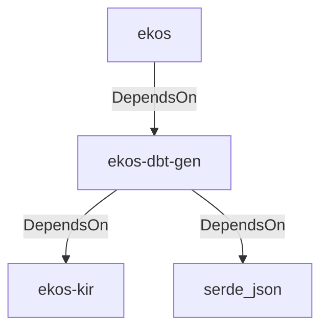

# ekos-dbt-gen (Crate)

## Properties

| Key | Value |
|---|---|
| `description` | RFC 0036 — Pentaho to dbt Model Export: renders compiled Transformation IR nodes as dbt SQL models + schema.yml |
| `path` | ekos/crates/dbt-gen |

## Relationships

### DependsOn

- ← ekos (`abd31cd9-b31d-54c5-87cd-8a4a5b9a30a0`) — evidence: ekos depends on ekos-dbt-gen (path dependency)
- → ekos-kir (`7e3bc0de-d888-55cd-aa9a-f333f6e2cbb2`) — evidence: ekos-dbt-gen depends on ekos-kir (path dependency)
- → serde_json (`02548eee-6478-5324-851f-3a6329ccfeca`) — evidence: ekos-dbt-gen depends on serde_json 1

## Diagram

## Evidence

- `9ae0ed55-1aaa-4e5a-bf17-f13617cbcb29` — ekos depends on ekos-dbt-gen (path dependency) (confidence: 1.00)
- `5b7b1c2b-f58a-4001-9b4c-540f86019b7e` — ekos-dbt-gen depends on ekos-kir (path dependency) (confidence: 1.00)
- `43b8e824-2d8f-4a7b-973c-995028f83221` — ekos-dbt-gen depends on serde_json 1 (confidence: 1.00)
