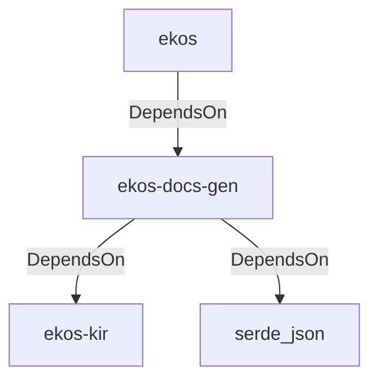

# ekos-docs-gen (Crate)

## Properties

| Key | Value |
|---|---|
| `description` | RFC 0035 — Generated Documentation: renders compiled ledger objects as Markdown/HTML/diagrams |
| `path` | ekos/crates/docs-gen |

## Relationships

### DependsOn

- ← ekos (`abd31cd9-b31d-54c5-87cd-8a4a5b9a30a0`) — evidence: ekos depends on ekos-docs-gen (path dependency)
- → ekos-kir (`7e3bc0de-d888-55cd-aa9a-f333f6e2cbb2`) — evidence: ekos-docs-gen depends on ekos-kir (path dependency)
- → serde_json (`02548eee-6478-5324-851f-3a6329ccfeca`) — evidence: ekos-docs-gen depends on serde_json 1

## Diagram

## Evidence

- `385e413d-d918-4021-95cf-fddb5d23d784` — ekos depends on ekos-docs-gen (path dependency) (confidence: 1.00)
- `b33ca652-fb90-47d2-8103-dd4a315f9c68` — ekos-docs-gen depends on ekos-kir (path dependency) (confidence: 1.00)
- `e5790954-4407-4f0c-a687-98c670d4f8f9` — ekos-docs-gen depends on serde_json 1 (confidence: 1.00)
