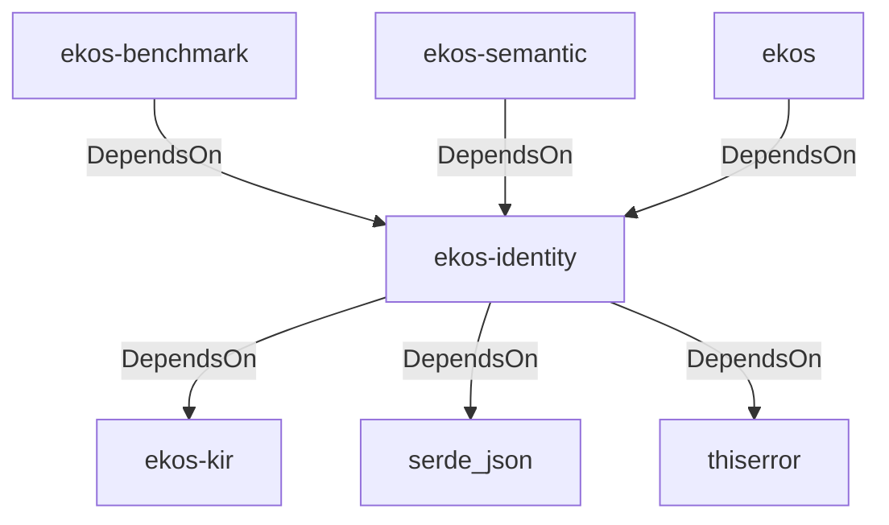

# ekos-identity (Crate)

## Properties

| Key | Value |
|---|---|
| `description` | Identity resolution — merges synonymous concepts (Phase 7) |
| `path` | ekos/crates/identity |

## Relationships

### DependsOn

- ← ekos-benchmark (`20c26e43-ee96-5ee7-a046-25740fbbd56b`) — evidence: ekos-benchmark depends on ekos-identity (path dependency)
- → ekos-kir (`7e3bc0de-d888-55cd-aa9a-f333f6e2cbb2`) — evidence: ekos-identity depends on ekos-kir (path dependency)
- → serde_json (`02548eee-6478-5324-851f-3a6329ccfeca`) — evidence: ekos-identity depends on serde 1
- → thiserror (`bbefe8a3-f76e-509f-910b-b439cd7eeff6`) — evidence: ekos-identity depends on thiserror 2
- ← ekos-semantic (`f82d9ce0-df2a-5af8-9f9a-2bd5f8484839`) — evidence: ekos-semantic depends on ekos-identity (path dependency)
- ← ekos (`abd31cd9-b31d-54c5-87cd-8a4a5b9a30a0`) — evidence: ekos depends on ekos-identity (path dependency)

## Diagram

## Evidence

- `e1cffde8-11ff-4f90-959d-4c051aba762e` — ekos-benchmark depends on ekos-identity (path dependency) (confidence: 1.00)
- `7b338491-5213-47cf-9afc-37025dae2163` — ekos-identity depends on ekos-kir (path dependency) (confidence: 1.00)
- `5aa438bc-459d-412f-902f-8154bba79bdc` — ekos-identity depends on serde 1 (confidence: 1.00)
- `7abd1f5a-fd1e-43f1-b09c-ce06e0763fdd` — ekos-identity depends on serde_json 1 (confidence: 1.00)
- `6b9d7d15-89b9-49e7-975f-e8a090df81b9` — ekos-identity depends on thiserror 2 (confidence: 1.00)
- `969ac429-a1e3-4ac8-8115-c4bda83492c2` — ekos-semantic depends on ekos-identity (path dependency) (confidence: 1.00)
- `5bf82180-137b-4ae7-818b-4adf212bf9be` — ekos depends on ekos-identity (path dependency) (confidence: 1.00)
