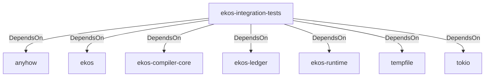

# ekos-integration-tests (Crate)

## Properties

| Key | Value |
|---|---|
| `description` |  |
| `path` | tests/integration |
| `version` | 0.1.0 |

## Relationships

### DependsOn

- → anyhow (`0cdec207-5b1a-5831-bd2a-8b57ddb8681c`) — evidence: ekos-integration-tests depends on anyhow 1
- → ekos (`abd31cd9-b31d-54c5-87cd-8a4a5b9a30a0`) — evidence: ekos-integration-tests depends on ekos (path dependency)
- → ekos-compiler-core (`2690bc0d-0233-516f-b969-9e87432f623d`) — evidence: ekos-integration-tests depends on ekos-compiler-core (path dependency)
- → ekos-ledger (`9c977335-c421-519c-a889-558f0487574e`) — evidence: ekos-integration-tests depends on ekos-ledger (path dependency)
- → ekos-runtime (`f4cd2d3b-f0b0-5234-ab2b-39de3275d717`) — evidence: ekos-integration-tests depends on ekos-runtime (path dependency)
- → tempfile (`5213e845-b54e-5710-9e19-bcdc640a0fb8`) — evidence: ekos-integration-tests depends on tempfile 3
- → tokio (`4a4e8d5c-5102-5d1d-addd-d7fb0bc8d7b9`) — evidence: ekos-integration-tests depends on tokio 1

## Diagram

## Evidence

- `f03325fe-37f9-42cb-b703-54b4b0706346` — ekos-integration-tests depends on anyhow 1 (confidence: 1.00)
- `e21b92de-3129-47a9-9cba-155eb8ad2478` — ekos-integration-tests depends on ekos (path dependency) (confidence: 1.00)
- `4ac97a54-257d-41c3-8903-e55f29e33dae` — ekos-integration-tests depends on ekos-compiler-core (path dependency) (confidence: 1.00)
- `46321c7c-851c-4304-ab8a-fbaa8dce915c` — ekos-integration-tests depends on ekos-ledger (path dependency) (confidence: 1.00)
- `44372c29-7bde-4b90-ab96-3da94dc319c9` — ekos-integration-tests depends on ekos-runtime (path dependency) (confidence: 1.00)
- `ea4ed272-c059-476d-980d-36597d0e6af2` — ekos-integration-tests depends on tempfile 3 (confidence: 1.00)
- `0465fd80-5bad-496d-aee6-34f5bd25aaf0` — ekos-integration-tests depends on tokio 1 (confidence: 1.00)
