# ekos-kir (Crate)

## Properties

| Key | Value |
|---|---|
| `description` | Knowledge Intermediate Representation — the four canonical node types |
| `path` | ekos/crates/kir |

## Relationships

### DependsOn

- ← ekos-benchmark (`20c26e43-ee96-5ee7-a046-25740fbbd56b`) — evidence: ekos-benchmark depends on ekos-kir (path dependency)
- ← ekos-identity (`2c6b8d9a-83ed-510e-a5d8-a76f2e8685fe`) — evidence: ekos-identity depends on ekos-kir (path dependency)
- ← ekos-semantic (`f82d9ce0-df2a-5af8-9f9a-2bd5f8484839`) — evidence: ekos-semantic depends on ekos-kir (path dependency)
- ← ekos-runtime (`f4cd2d3b-f0b0-5234-ab2b-39de3275d717`) — evidence: ekos-runtime depends on ekos-kir (path dependency)
- ← ekos-compiler-core (`2690bc0d-0233-516f-b969-9e87432f623d`) — evidence: ekos-compiler-core depends on ekos-kir (path dependency)
- → chrono (`0d184cc1-2483-516d-a0b5-0b6bfad54805`) — evidence: ekos-kir depends on chrono 0.4
- → ekos-common (`dc169f0a-98f1-5c7c-8dd0-1dbc8504e9c9`) — evidence: ekos-kir depends on ekos-common (path dependency)
- → serde_json (`02548eee-6478-5324-851f-3a6329ccfeca`) — evidence: ekos-kir depends on serde 1
- → thiserror (`bbefe8a3-f76e-509f-910b-b439cd7eeff6`) — evidence: ekos-kir depends on thiserror 2
- → uuid (`ba61f6c0-d160-5eaf-a437-895cee5c72e9`) — evidence: ekos-kir depends on uuid 1
- ← ekos (`abd31cd9-b31d-54c5-87cd-8a4a5b9a30a0`) — evidence: ekos depends on ekos-kir (path dependency)
- ← ekos-artifact (`8806bf54-6364-5052-b85a-cef4344e8f19`) — evidence: ekos-artifact depends on ekos-kir (path dependency)
- ← ekos-dbt-gen (`9b66a043-a009-58d6-b446-20001b04c706`) — evidence: ekos-dbt-gen depends on ekos-kir (path dependency)
- ← ekos-ekl (`d932eaf4-7069-5419-a00c-fa4b7b374c86`) — evidence: ekos-ekl depends on ekos-kir (path dependency)
- ← ekos-docs-gen (`ee66e2d3-bd7f-53c2-a9f9-7dcb7cba59b3`) — evidence: ekos-docs-gen depends on ekos-kir (path dependency)
- ← ekos-recovery (`28244ebb-4e16-5e8d-a637-5e750d01f2b8`) — evidence: ekos-recovery depends on ekos-kir (path dependency)
- ← ekos-ledger (`9c977335-c421-519c-a889-558f0487574e`) — evidence: ekos-ledger depends on ekos-kir (path dependency)

## Diagram

```mermaid
graph TD
    n7e3bc0ded88855cdaa9af333f6e2cbb2["ekos-kir"]
    n20c26e43ee965ee7a04625740fbbd56b["ekos-benchmark"]
    n20c26e43ee965ee7a04625740fbbd56b -->|DependsOn| n7e3bc0ded88855cdaa9af333f6e2cbb2
    n2c6b8d9a83ed510ea5d8a76f2e8685fe["ekos-identity"]
    n2c6b8d9a83ed510ea5d8a76f2e8685fe -->|DependsOn| n7e3bc0ded88855cdaa9af333f6e2cbb2
    nf82d9ce0df2a5af89f9a2bd5f8484839["ekos-semantic"]
    nf82d9ce0df2a5af89f9a2bd5f8484839 -->|DependsOn| n7e3bc0ded88855cdaa9af333f6e2cbb2
    nf4cd2d3bf0b05234ab2b39de3275d717["ekos-runtime"]
    nf4cd2d3bf0b05234ab2b39de3275d717 -->|DependsOn| n7e3bc0ded88855cdaa9af333f6e2cbb2
    n2690bc0d0233516fb9699e87432f623d["ekos-compiler-core"]
    n2690bc0d0233516fb9699e87432f623d -->|DependsOn| n7e3bc0ded88855cdaa9af333f6e2cbb2
    n0d184cc12483516da0b50b6bfad54805["chrono"]
    n7e3bc0ded88855cdaa9af333f6e2cbb2 -->|DependsOn| n0d184cc12483516da0b50b6bfad54805
    ndc169f0a98f15c7c8dd01dbc8504e9c9["ekos-common"]
    n7e3bc0ded88855cdaa9af333f6e2cbb2 -->|DependsOn| ndc169f0a98f15c7c8dd01dbc8504e9c9
    n02548eee64785324851f3a6329ccfeca["serde_json"]
    n7e3bc0ded88855cdaa9af333f6e2cbb2 -->|DependsOn| n02548eee64785324851f3a6329ccfeca
    nbbefe8a3f76e509f910bb439cd7eeff6["thiserror"]
    n7e3bc0ded88855cdaa9af333f6e2cbb2 -->|DependsOn| nbbefe8a3f76e509f910bb439cd7eeff6
    nba61f6c0d1605eafa437895cee5c72e9["uuid"]
    n7e3bc0ded88855cdaa9af333f6e2cbb2 -->|DependsOn| nba61f6c0d1605eafa437895cee5c72e9
    nabd31cd9b31d54c587cd8a4a5b9a30a0["ekos"]
    nabd31cd9b31d54c587cd8a4a5b9a30a0 -->|DependsOn| n7e3bc0ded88855cdaa9af333f6e2cbb2
    n8806bf5463645052b85acef4344e8f19["ekos-artifact"]
    n8806bf5463645052b85acef4344e8f19 -->|DependsOn| n7e3bc0ded88855cdaa9af333f6e2cbb2
    n9b66a043a00958d6b44620001b04c706["ekos-dbt-gen"]
    n9b66a043a00958d6b44620001b04c706 -->|DependsOn| n7e3bc0ded88855cdaa9af333f6e2cbb2
    nd932eaf470695419a00cfa4b7b374c86["ekos-ekl"]
    nd932eaf470695419a00cfa4b7b374c86 -->|DependsOn| n7e3bc0ded88855cdaa9af333f6e2cbb2
    nee66e2d3bd7f53c2a9f97dcb7cba59b3["ekos-docs-gen"]
    nee66e2d3bd7f53c2a9f97dcb7cba59b3 -->|DependsOn| n7e3bc0ded88855cdaa9af333f6e2cbb2
    n28244ebb4e165e8da6375e750d01f2b8["ekos-recovery"]
    n28244ebb4e165e8da6375e750d01f2b8 -->|DependsOn| n7e3bc0ded88855cdaa9af333f6e2cbb2
    n9c977335c421519ca889558f0487574e["ekos-ledger"]
    n9c977335c421519ca889558f0487574e -->|DependsOn| n7e3bc0ded88855cdaa9af333f6e2cbb2
```

## Evidence

- `f5703840-255d-4b4a-ba88-c88b64969457` — ekos-benchmark depends on ekos-kir (path dependency) (confidence: 1.00)
- `7b338491-5213-47cf-9afc-37025dae2163` — ekos-identity depends on ekos-kir (path dependency) (confidence: 1.00)
- `1048ce03-94bb-4c6e-9412-794a7761982c` — ekos-semantic depends on ekos-kir (path dependency) (confidence: 1.00)
- `eeb2cb7a-9438-4eb2-adfd-3996316a8d62` — ekos-runtime depends on ekos-kir (path dependency) (confidence: 1.00)
- `c85bf442-4bef-4a75-a491-1214be42182b` — ekos-compiler-core depends on ekos-kir (path dependency) (confidence: 1.00)
- `e49c052c-8d4d-4c38-a3a3-faa0a5ece8bb` — ekos-kir depends on chrono 0.4 (confidence: 1.00)
- `5ef2c413-d743-4b1e-a375-992780f039d6` — ekos-kir depends on ekos-common (path dependency) (confidence: 1.00)
- `dca503d7-d0c7-4040-bad6-a41fccd35ab8` — ekos-kir depends on serde 1 (confidence: 1.00)
- `6cfecab4-c1cb-4131-8ce7-f886eefcb998` — ekos-kir depends on serde_json 1 (confidence: 1.00)
- `f93763a9-c6d3-4dfe-8ef9-c2a6a0cf805a` — ekos-kir depends on thiserror 2 (confidence: 1.00)
- `6a915f14-4f3f-4231-9f32-8fff4c51005c` — ekos-kir depends on uuid 1 (confidence: 1.00)
- `5fc48415-706e-4d6a-a986-4c07e76a59b0` — ekos depends on ekos-kir (path dependency) (confidence: 1.00)
- `d7c24a8f-e8f3-4f88-be54-44bfc5d08308` — ekos-artifact depends on ekos-kir (path dependency) (confidence: 1.00)
- `5b7b1c2b-f58a-4001-9b4c-540f86019b7e` — ekos-dbt-gen depends on ekos-kir (path dependency) (confidence: 1.00)
- `76336514-faf2-4162-ac35-3e13a005cede` — ekos-ekl depends on ekos-kir (path dependency) (confidence: 1.00)
- `b33ca652-fb90-47d2-8103-dd4a315f9c68` — ekos-docs-gen depends on ekos-kir (path dependency) (confidence: 1.00)
- `c909d073-d12c-4714-837e-91a81085ca84` — ekos-recovery depends on ekos-kir (path dependency) (confidence: 1.00)
- `bd4d9188-ac3b-494a-9de2-503015739b60` — ekos-ledger depends on ekos-kir (path dependency) (confidence: 1.00)
