# ekos-ledger (Crate)

## Properties

| Key | Value |
|---|---|
| `description` | Append-only semantic knowledge ledger (skeleton — SQLite backend) |
| `path` | ekos/crates/ledger |

## Relationships

### DependsOn

- ← ekos-benchmark (`20c26e43-ee96-5ee7-a046-25740fbbd56b`) — evidence: ekos-benchmark depends on ekos-ledger (path dependency)
- ← ekos-integration-tests (`063808f9-5f19-5d62-b3dd-69eaa93d44cb`) — evidence: ekos-integration-tests depends on ekos-ledger (path dependency)
- ← ekos-runtime (`f4cd2d3b-f0b0-5234-ab2b-39de3275d717`) — evidence: ekos-runtime depends on ekos-ledger (path dependency)
- ← ekos (`abd31cd9-b31d-54c5-87cd-8a4a5b9a30a0`) — evidence: ekos depends on ekos-ledger (path dependency)
- → chrono (`0d184cc1-2483-516d-a0b5-0b6bfad54805`) — evidence: ekos-ledger depends on chrono 0.4
- → ekos-artifact (`8806bf54-6364-5052-b85a-cef4344e8f19`) — evidence: ekos-ledger depends on ekos-artifact (path dependency)
- → ekos-common (`dc169f0a-98f1-5c7c-8dd0-1dbc8504e9c9`) — evidence: ekos-ledger depends on ekos-common (path dependency)
- → ekos-kir (`7e3bc0de-d888-55cd-aa9a-f333f6e2cbb2`) — evidence: ekos-ledger depends on ekos-kir (path dependency)
- → hex (`fa785806-31c3-5308-ae4a-2898a2c181ca`) — evidence: ekos-ledger depends on hex 0.4
- → memmap2 (`93b110a4-a67a-5f61-8d8c-3a8783f3e21d`) — evidence: ekos-ledger depends on memmap2 0.9
- → rusqlite (`f703a159-d795-5822-a722-b56ef4c86c79`) — evidence: ekos-ledger depends on rusqlite 0.32
- → serde_json (`02548eee-6478-5324-851f-3a6329ccfeca`) — evidence: ekos-ledger depends on serde 1
- → sha2 (`64d6fba9-eea7-52e6-9b3a-b2e887a6944f`) — evidence: ekos-ledger depends on sha2 0.10
- → tantivy (`e8d5bdce-0c48-5348-b7ca-520e1c3733f7`) — evidence: ekos-ledger depends on tantivy 0.22
- → thiserror (`bbefe8a3-f76e-509f-910b-b439cd7eeff6`) — evidence: ekos-ledger depends on thiserror 2
- → tracing (`4282d266-2850-5d04-a992-0f0a204788aa`) — evidence: ekos-ledger depends on tracing 0.1
- → uuid (`ba61f6c0-d160-5eaf-a437-895cee5c72e9`) — evidence: ekos-ledger depends on uuid 1
- → zstd (`3d9eb6f7-8fd9-528a-948f-7ab0cab3e3c5`) — evidence: ekos-ledger depends on zstd 0.13

## Diagram

```mermaid
graph TD
    n9c977335c421519ca889558f0487574e["ekos-ledger"]
    n20c26e43ee965ee7a04625740fbbd56b["ekos-benchmark"]
    n20c26e43ee965ee7a04625740fbbd56b -->|DependsOn| n9c977335c421519ca889558f0487574e
    n063808f95f195d62b3dd69eaa93d44cb["ekos-integration-tests"]
    n063808f95f195d62b3dd69eaa93d44cb -->|DependsOn| n9c977335c421519ca889558f0487574e
    nf4cd2d3bf0b05234ab2b39de3275d717["ekos-runtime"]
    nf4cd2d3bf0b05234ab2b39de3275d717 -->|DependsOn| n9c977335c421519ca889558f0487574e
    nabd31cd9b31d54c587cd8a4a5b9a30a0["ekos"]
    nabd31cd9b31d54c587cd8a4a5b9a30a0 -->|DependsOn| n9c977335c421519ca889558f0487574e
    n0d184cc12483516da0b50b6bfad54805["chrono"]
    n9c977335c421519ca889558f0487574e -->|DependsOn| n0d184cc12483516da0b50b6bfad54805
    n8806bf5463645052b85acef4344e8f19["ekos-artifact"]
    n9c977335c421519ca889558f0487574e -->|DependsOn| n8806bf5463645052b85acef4344e8f19
    ndc169f0a98f15c7c8dd01dbc8504e9c9["ekos-common"]
    n9c977335c421519ca889558f0487574e -->|DependsOn| ndc169f0a98f15c7c8dd01dbc8504e9c9
    n7e3bc0ded88855cdaa9af333f6e2cbb2["ekos-kir"]
    n9c977335c421519ca889558f0487574e -->|DependsOn| n7e3bc0ded88855cdaa9af333f6e2cbb2
    nfa78580631c35308ae4a2898a2c181ca["hex"]
    n9c977335c421519ca889558f0487574e -->|DependsOn| nfa78580631c35308ae4a2898a2c181ca
    n93b110a4a67a5f618d8c3a8783f3e21d["memmap2"]
    n9c977335c421519ca889558f0487574e -->|DependsOn| n93b110a4a67a5f618d8c3a8783f3e21d
    nf703a159d7955822a722b56ef4c86c79["rusqlite"]
    n9c977335c421519ca889558f0487574e -->|DependsOn| nf703a159d7955822a722b56ef4c86c79
    n02548eee64785324851f3a6329ccfeca["serde_json"]
    n9c977335c421519ca889558f0487574e -->|DependsOn| n02548eee64785324851f3a6329ccfeca
    n64d6fba9eea752e69b3ab2e887a6944f["sha2"]
    n9c977335c421519ca889558f0487574e -->|DependsOn| n64d6fba9eea752e69b3ab2e887a6944f
    ne8d5bdce0c485348b7ca520e1c3733f7["tantivy"]
    n9c977335c421519ca889558f0487574e -->|DependsOn| ne8d5bdce0c485348b7ca520e1c3733f7
    nbbefe8a3f76e509f910bb439cd7eeff6["thiserror"]
    n9c977335c421519ca889558f0487574e -->|DependsOn| nbbefe8a3f76e509f910bb439cd7eeff6
    n4282d26628505d04a9920f0a204788aa["tracing"]
    n9c977335c421519ca889558f0487574e -->|DependsOn| n4282d26628505d04a9920f0a204788aa
    nba61f6c0d1605eafa437895cee5c72e9["uuid"]
    n9c977335c421519ca889558f0487574e -->|DependsOn| nba61f6c0d1605eafa437895cee5c72e9
    n3d9eb6f78fd9528a948f7ab0cab3e3c5["zstd"]
    n9c977335c421519ca889558f0487574e -->|DependsOn| n3d9eb6f78fd9528a948f7ab0cab3e3c5
```

## Evidence

- `11da57c3-874c-47e4-9518-5f31e43ff24c` — ekos-benchmark depends on ekos-ledger (path dependency) (confidence: 1.00)
- `46321c7c-851c-4304-ab8a-fbaa8dce915c` — ekos-integration-tests depends on ekos-ledger (path dependency) (confidence: 1.00)
- `c5e270bf-1a7e-4af6-b7aa-ca398bb4ac4e` — ekos-runtime depends on ekos-ledger (path dependency) (confidence: 1.00)
- `e45bd854-9dd9-4993-a1d5-ce9597052a69` — ekos depends on ekos-ledger (path dependency) (confidence: 1.00)
- `1dd21f18-ba3e-4a7c-850b-87438e8e886a` — ekos-ledger depends on chrono 0.4 (confidence: 1.00)
- `b766c09e-1b9b-48bf-aa94-ab8c432873a7` — ekos-ledger depends on ekos-artifact (path dependency) (confidence: 1.00)
- `3e10917d-b295-4f78-81fe-a26489f4190e` — ekos-ledger depends on ekos-common (path dependency) (confidence: 1.00)
- `bd4d9188-ac3b-494a-9de2-503015739b60` — ekos-ledger depends on ekos-kir (path dependency) (confidence: 1.00)
- `37902a57-9d92-4092-89d5-3da037f1ed63` — ekos-ledger depends on hex 0.4 (confidence: 1.00)
- `4bfc223c-9d8f-401f-aa65-80de626773c8` — ekos-ledger depends on memmap2 0.9 (confidence: 1.00)
- `c232be1f-8d45-4562-a50e-fc3c11c8de8a` — ekos-ledger depends on rusqlite 0.32 (confidence: 1.00)
- `1dd799ff-dd88-4f27-865d-4c6dc61bba06` — ekos-ledger depends on serde 1 (confidence: 1.00)
- `7d76c2fc-cbce-4306-a876-87a2ed76675a` — ekos-ledger depends on serde_json 1 (confidence: 1.00)
- `23705374-fb5a-4f05-9956-71bf2db728f0` — ekos-ledger depends on sha2 0.10 (confidence: 1.00)
- `681c9912-9d83-4649-a69f-b29b003acf6c` — ekos-ledger depends on tantivy 0.22 (confidence: 1.00)
- `8ed06118-65c9-493e-8a8e-9967fccd8bbd` — ekos-ledger depends on thiserror 2 (confidence: 1.00)
- `d62d42e9-87d7-498c-8ce8-8ae75943139c` — ekos-ledger depends on tracing 0.1 (confidence: 1.00)
- `c50276bc-4e5e-4f33-ab34-eb94d7834e3b` — ekos-ledger depends on uuid 1 (confidence: 1.00)
- `e3d654c8-8a95-4a58-bd03-909a30b5bc8a` — ekos-ledger depends on zstd 0.13 (confidence: 1.00)
