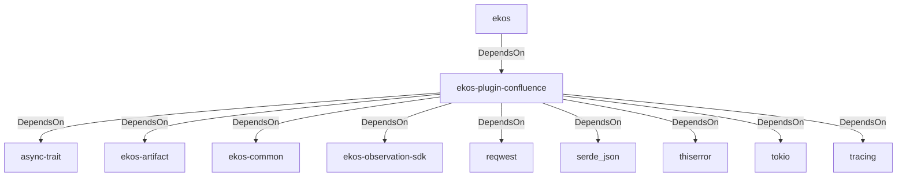

# ekos-plugin-confluence (Crate)

## Properties

| Key | Value |
|---|---|
| `description` | Confluence page observer plugin (proof-of-concept — see RFC 0022) |
| `path` | ekos/plugins/confluence |

## Relationships

### DependsOn

- ← ekos (`abd31cd9-b31d-54c5-87cd-8a4a5b9a30a0`) — evidence: ekos depends on ekos-plugin-confluence (path dependency)
- → async-trait (`7c905290-824b-57e0-a559-15ff1499b4d6`) — evidence: ekos-plugin-confluence depends on async-trait 0.1
- → ekos-artifact (`8806bf54-6364-5052-b85a-cef4344e8f19`) — evidence: ekos-plugin-confluence depends on ekos-artifact (path dependency)
- → ekos-common (`dc169f0a-98f1-5c7c-8dd0-1dbc8504e9c9`) — evidence: ekos-plugin-confluence depends on ekos-common (path dependency)
- → ekos-observation-sdk (`9a955a3a-55bc-587a-942d-fb81d6260052`) — evidence: ekos-plugin-confluence depends on ekos-observation-sdk (path dependency)
- → reqwest (`70acdf50-6295-5f0c-9157-cb9866d0ec23`) — evidence: ekos-plugin-confluence depends on reqwest 0.12
- → serde_json (`02548eee-6478-5324-851f-3a6329ccfeca`) — evidence: ekos-plugin-confluence depends on serde 1
- → thiserror (`bbefe8a3-f76e-509f-910b-b439cd7eeff6`) — evidence: ekos-plugin-confluence depends on thiserror 2
- → tokio (`4a4e8d5c-5102-5d1d-addd-d7fb0bc8d7b9`) — evidence: ekos-plugin-confluence depends on tokio 1
- → tracing (`4282d266-2850-5d04-a992-0f0a204788aa`) — evidence: ekos-plugin-confluence depends on tracing 0.1

## Diagram

## Evidence

- `030afd51-a4a4-47fd-b5c4-d4bdab3f2bde` — ekos depends on ekos-plugin-confluence (path dependency) (confidence: 1.00)
- `ef24afa9-a7c8-4bdd-8928-5f672c1b77f1` — ekos-plugin-confluence depends on async-trait 0.1 (confidence: 1.00)
- `b7d9d1d0-1593-41ad-aff9-addb326bdb0e` — ekos-plugin-confluence depends on ekos-artifact (path dependency) (confidence: 1.00)
- `daaa5aa5-d6f9-496d-a75a-25da41eb5b59` — ekos-plugin-confluence depends on ekos-common (path dependency) (confidence: 1.00)
- `81908e8d-45bc-4064-9a80-1368e2716662` — ekos-plugin-confluence depends on ekos-observation-sdk (path dependency) (confidence: 1.00)
- `c74486c5-cdf3-4705-aa91-7a50d824ffb8` — ekos-plugin-confluence depends on reqwest 0.12 (confidence: 1.00)
- `3b599883-25ae-4b99-b4f8-1e2008d4600e` — ekos-plugin-confluence depends on serde 1 (confidence: 1.00)
- `8791398a-18e6-4a5c-87de-f5f24acc3fe0` — ekos-plugin-confluence depends on serde_json 1 (confidence: 1.00)
- `8d16c9fc-e0af-45cf-9542-49c67e7c185d` — ekos-plugin-confluence depends on thiserror 2 (confidence: 1.00)
- `d84470be-f3b7-48ff-ab01-786e0c7ad098` — ekos-plugin-confluence depends on tokio 1 (confidence: 1.00)
- `95f28cf3-24d8-4aab-9fac-9228f71803c5` — ekos-plugin-confluence depends on tracing 0.1 (confidence: 1.00)
