# ekos-plugin-crypto (Crate)

## Properties

| Key | Value |
|---|---|
| `description` | DeFi Sentinel crypto entity/relationship/evidence observer plugin (see RFC 0017) |
| `path` | ekos/plugins/crypto |

## Relationships

### DependsOn

- ← ekos (`abd31cd9-b31d-54c5-87cd-8a4a5b9a30a0`) — evidence: ekos depends on ekos-plugin-crypto (path dependency)
- → async-trait (`7c905290-824b-57e0-a559-15ff1499b4d6`) — evidence: ekos-plugin-crypto depends on async-trait 0.1
- → chrono (`0d184cc1-2483-516d-a0b5-0b6bfad54805`) — evidence: ekos-plugin-crypto depends on chrono 0.4
- → ekos-artifact (`8806bf54-6364-5052-b85a-cef4344e8f19`) — evidence: ekos-plugin-crypto depends on ekos-artifact (path dependency)
- → ekos-common (`dc169f0a-98f1-5c7c-8dd0-1dbc8504e9c9`) — evidence: ekos-plugin-crypto depends on ekos-common (path dependency)
- → ekos-observation-sdk (`9a955a3a-55bc-587a-942d-fb81d6260052`) — evidence: ekos-plugin-crypto depends on ekos-observation-sdk (path dependency)
- → parquet (`094f95ed-1135-51b1-ae68-7059de82320f`) — evidence: ekos-plugin-crypto depends on parquet 53
- → serde_json (`02548eee-6478-5324-851f-3a6329ccfeca`) — evidence: ekos-plugin-crypto depends on serde 1
- → thiserror (`bbefe8a3-f76e-509f-910b-b439cd7eeff6`) — evidence: ekos-plugin-crypto depends on thiserror 2
- → tokio (`4a4e8d5c-5102-5d1d-addd-d7fb0bc8d7b9`) — evidence: ekos-plugin-crypto depends on tokio 1
- → tracing (`4282d266-2850-5d04-a992-0f0a204788aa`) — evidence: ekos-plugin-crypto depends on tracing 0.1
- → uuid (`ba61f6c0-d160-5eaf-a437-895cee5c72e9`) — evidence: ekos-plugin-crypto depends on uuid 1

## Diagram

```mermaid
graph TD
    n835d6e675bb053e79104338881612548["ekos-plugin-crypto"]
    nabd31cd9b31d54c587cd8a4a5b9a30a0["ekos"]
    nabd31cd9b31d54c587cd8a4a5b9a30a0 -->|DependsOn| n835d6e675bb053e79104338881612548
    n7c905290824b57e0a55915ff1499b4d6["async-trait"]
    n835d6e675bb053e79104338881612548 -->|DependsOn| n7c905290824b57e0a55915ff1499b4d6
    n0d184cc12483516da0b50b6bfad54805["chrono"]
    n835d6e675bb053e79104338881612548 -->|DependsOn| n0d184cc12483516da0b50b6bfad54805
    n8806bf5463645052b85acef4344e8f19["ekos-artifact"]
    n835d6e675bb053e79104338881612548 -->|DependsOn| n8806bf5463645052b85acef4344e8f19
    ndc169f0a98f15c7c8dd01dbc8504e9c9["ekos-common"]
    n835d6e675bb053e79104338881612548 -->|DependsOn| ndc169f0a98f15c7c8dd01dbc8504e9c9
    n9a955a3a55bc587a942dfb81d6260052["ekos-observation-sdk"]
    n835d6e675bb053e79104338881612548 -->|DependsOn| n9a955a3a55bc587a942dfb81d6260052
    n094f95ed113551b1ae687059de82320f["parquet"]
    n835d6e675bb053e79104338881612548 -->|DependsOn| n094f95ed113551b1ae687059de82320f
    n02548eee64785324851f3a6329ccfeca["serde_json"]
    n835d6e675bb053e79104338881612548 -->|DependsOn| n02548eee64785324851f3a6329ccfeca
    nbbefe8a3f76e509f910bb439cd7eeff6["thiserror"]
    n835d6e675bb053e79104338881612548 -->|DependsOn| nbbefe8a3f76e509f910bb439cd7eeff6
    n4a4e8d5c51025d1dadddd7fb0bc8d7b9["tokio"]
    n835d6e675bb053e79104338881612548 -->|DependsOn| n4a4e8d5c51025d1dadddd7fb0bc8d7b9
    n4282d26628505d04a9920f0a204788aa["tracing"]
    n835d6e675bb053e79104338881612548 -->|DependsOn| n4282d26628505d04a9920f0a204788aa
    nba61f6c0d1605eafa437895cee5c72e9["uuid"]
    n835d6e675bb053e79104338881612548 -->|DependsOn| nba61f6c0d1605eafa437895cee5c72e9
```

## Evidence

- `175e1656-59f1-443b-a09d-7b1c99f70d86` — ekos depends on ekos-plugin-crypto (path dependency) (confidence: 1.00)
- `91fb97eb-ac22-43ae-be93-20bd27f84801` — ekos-plugin-crypto depends on async-trait 0.1 (confidence: 1.00)
- `d39cc479-3ff2-4962-bc36-3b2c8730d665` — ekos-plugin-crypto depends on chrono 0.4 (confidence: 1.00)
- `6238100d-428c-4442-89df-f9348e952aa9` — ekos-plugin-crypto depends on ekos-artifact (path dependency) (confidence: 1.00)
- `fa60e30a-ab94-4871-8f54-27697895ba4e` — ekos-plugin-crypto depends on ekos-common (path dependency) (confidence: 1.00)
- `c57d4925-9ed0-4e38-b572-2ce1befc39ae` — ekos-plugin-crypto depends on ekos-observation-sdk (path dependency) (confidence: 1.00)
- `4266733e-c7c8-4e9b-bd70-f70bcfc9a26c` — ekos-plugin-crypto depends on parquet 53 (confidence: 1.00)
- `4e3f320a-927a-4157-83b3-2b4d1e44311b` — ekos-plugin-crypto depends on serde 1 (confidence: 1.00)
- `d96b67ab-3e80-4893-8e32-6c77ba06ce70` — ekos-plugin-crypto depends on serde_json 1 (confidence: 1.00)
- `91563ee1-b1fd-4d51-9d63-1e423bbb6f1a` — ekos-plugin-crypto depends on thiserror 2 (confidence: 1.00)
- `9137e9d9-6beb-415a-8298-7b539391c76d` — ekos-plugin-crypto depends on tokio 1 (confidence: 1.00)
- `23d50d67-308a-4520-af6a-047ad8534612` — ekos-plugin-crypto depends on tracing 0.1 (confidence: 1.00)
- `efcb6c6b-103a-4986-841b-33c7faaa315f` — ekos-plugin-crypto depends on uuid 1 (confidence: 1.00)
