# ekos-plugin-file (Crate)

## Properties

| Key | Value |
|---|---|
| `description` | File system observer plugin (Phase 3) |
| `path` | ekos/plugins/file |

## Relationships

### DependsOn

- ← ekos (`abd31cd9-b31d-54c5-87cd-8a4a5b9a30a0`) — evidence: ekos depends on ekos-plugin-file (path dependency)
- → async-trait (`7c905290-824b-57e0-a559-15ff1499b4d6`) — evidence: ekos-plugin-file depends on async-trait 0.1
- → ekos-artifact (`8806bf54-6364-5052-b85a-cef4344e8f19`) — evidence: ekos-plugin-file depends on ekos-artifact (path dependency)
- → ekos-common (`dc169f0a-98f1-5c7c-8dd0-1dbc8504e9c9`) — evidence: ekos-plugin-file depends on ekos-common (path dependency)
- → ekos-observation-sdk (`9a955a3a-55bc-587a-942d-fb81d6260052`) — evidence: ekos-plugin-file depends on ekos-observation-sdk (path dependency)
- → hex (`fa785806-31c3-5308-ae4a-2898a2c181ca`) — evidence: ekos-plugin-file depends on hex 0.4
- → serde_json (`02548eee-6478-5324-851f-3a6329ccfeca`) — evidence: ekos-plugin-file depends on serde_json 1
- → sha2 (`64d6fba9-eea7-52e6-9b3a-b2e887a6944f`) — evidence: ekos-plugin-file depends on sha2 0.10
- → thiserror (`bbefe8a3-f76e-509f-910b-b439cd7eeff6`) — evidence: ekos-plugin-file depends on thiserror 2
- → tokio (`4a4e8d5c-5102-5d1d-addd-d7fb0bc8d7b9`) — evidence: ekos-plugin-file depends on tokio 1
- → tracing (`4282d266-2850-5d04-a992-0f0a204788aa`) — evidence: ekos-plugin-file depends on tracing 0.1
- → walkdir (`40b5029d-b6e8-55ee-bc22-14411e3d0fb2`) — evidence: ekos-plugin-file depends on walkdir 2

## Diagram

```mermaid
graph TD
    n06b65958abb75fe1a6eed35946d39062["ekos-plugin-file"]
    nabd31cd9b31d54c587cd8a4a5b9a30a0["ekos"]
    nabd31cd9b31d54c587cd8a4a5b9a30a0 -->|DependsOn| n06b65958abb75fe1a6eed35946d39062
    n7c905290824b57e0a55915ff1499b4d6["async-trait"]
    n06b65958abb75fe1a6eed35946d39062 -->|DependsOn| n7c905290824b57e0a55915ff1499b4d6
    n8806bf5463645052b85acef4344e8f19["ekos-artifact"]
    n06b65958abb75fe1a6eed35946d39062 -->|DependsOn| n8806bf5463645052b85acef4344e8f19
    ndc169f0a98f15c7c8dd01dbc8504e9c9["ekos-common"]
    n06b65958abb75fe1a6eed35946d39062 -->|DependsOn| ndc169f0a98f15c7c8dd01dbc8504e9c9
    n9a955a3a55bc587a942dfb81d6260052["ekos-observation-sdk"]
    n06b65958abb75fe1a6eed35946d39062 -->|DependsOn| n9a955a3a55bc587a942dfb81d6260052
    nfa78580631c35308ae4a2898a2c181ca["hex"]
    n06b65958abb75fe1a6eed35946d39062 -->|DependsOn| nfa78580631c35308ae4a2898a2c181ca
    n02548eee64785324851f3a6329ccfeca["serde_json"]
    n06b65958abb75fe1a6eed35946d39062 -->|DependsOn| n02548eee64785324851f3a6329ccfeca
    n64d6fba9eea752e69b3ab2e887a6944f["sha2"]
    n06b65958abb75fe1a6eed35946d39062 -->|DependsOn| n64d6fba9eea752e69b3ab2e887a6944f
    nbbefe8a3f76e509f910bb439cd7eeff6["thiserror"]
    n06b65958abb75fe1a6eed35946d39062 -->|DependsOn| nbbefe8a3f76e509f910bb439cd7eeff6
    n4a4e8d5c51025d1dadddd7fb0bc8d7b9["tokio"]
    n06b65958abb75fe1a6eed35946d39062 -->|DependsOn| n4a4e8d5c51025d1dadddd7fb0bc8d7b9
    n4282d26628505d04a9920f0a204788aa["tracing"]
    n06b65958abb75fe1a6eed35946d39062 -->|DependsOn| n4282d26628505d04a9920f0a204788aa
    n40b5029db6e855eebc2214411e3d0fb2["walkdir"]
    n06b65958abb75fe1a6eed35946d39062 -->|DependsOn| n40b5029db6e855eebc2214411e3d0fb2
```

## Evidence

- `14bb7f8c-7768-49e5-80b3-5e687a74058e` — ekos depends on ekos-plugin-file (path dependency) (confidence: 1.00)
- `de5ff6b5-2998-4915-8c0d-8157d74b48ee` — ekos-plugin-file depends on async-trait 0.1 (confidence: 1.00)
- `e5e9bb48-398d-4196-9778-6cd4374121f5` — ekos-plugin-file depends on ekos-artifact (path dependency) (confidence: 1.00)
- `556f6d51-daa7-4270-9f2f-9ca11ea77f4e` — ekos-plugin-file depends on ekos-common (path dependency) (confidence: 1.00)
- `e831713c-c0cd-42b7-af47-5ebd8af45399` — ekos-plugin-file depends on ekos-observation-sdk (path dependency) (confidence: 1.00)
- `bfbb1833-519e-4d86-be2a-d7aba7d3ff76` — ekos-plugin-file depends on hex 0.4 (confidence: 1.00)
- `a06afb75-7832-4e8c-9225-9f1b91c2db00` — ekos-plugin-file depends on serde_json 1 (confidence: 1.00)
- `31f8bea2-b24e-4fab-89e4-d02d60cf4157` — ekos-plugin-file depends on sha2 0.10 (confidence: 1.00)
- `1ce973e1-f966-4e23-8dd3-6e42c0ebd237` — ekos-plugin-file depends on thiserror 2 (confidence: 1.00)
- `2f8fb127-42bc-470c-b41f-fc17d58c2e74` — ekos-plugin-file depends on tokio 1 (confidence: 1.00)
- `755424df-c39e-4de9-be10-258013b9734e` — ekos-plugin-file depends on tracing 0.1 (confidence: 1.00)
- `964a78a5-ab72-4530-8f2d-0abd363d223d` — ekos-plugin-file depends on walkdir 2 (confidence: 1.00)
