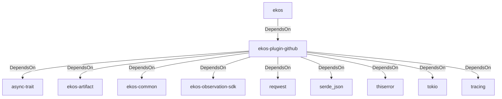

# ekos-plugin-github (Crate)

## Properties

| Key | Value |
|---|---|
| `description` | GitHub issues/PRs observer plugin (proof-of-concept — see RFC 0020) |
| `path` | ekos/plugins/github |

## Relationships

### DependsOn

- ← ekos (`abd31cd9-b31d-54c5-87cd-8a4a5b9a30a0`) — evidence: ekos depends on ekos-plugin-github (path dependency)
- → async-trait (`7c905290-824b-57e0-a559-15ff1499b4d6`) — evidence: ekos-plugin-github depends on async-trait 0.1
- → ekos-artifact (`8806bf54-6364-5052-b85a-cef4344e8f19`) — evidence: ekos-plugin-github depends on ekos-artifact (path dependency)
- → ekos-common (`dc169f0a-98f1-5c7c-8dd0-1dbc8504e9c9`) — evidence: ekos-plugin-github depends on ekos-common (path dependency)
- → ekos-observation-sdk (`9a955a3a-55bc-587a-942d-fb81d6260052`) — evidence: ekos-plugin-github depends on ekos-observation-sdk (path dependency)
- → reqwest (`70acdf50-6295-5f0c-9157-cb9866d0ec23`) — evidence: ekos-plugin-github depends on reqwest 0.12
- → serde_json (`02548eee-6478-5324-851f-3a6329ccfeca`) — evidence: ekos-plugin-github depends on serde 1
- → thiserror (`bbefe8a3-f76e-509f-910b-b439cd7eeff6`) — evidence: ekos-plugin-github depends on thiserror 2
- → tokio (`4a4e8d5c-5102-5d1d-addd-d7fb0bc8d7b9`) — evidence: ekos-plugin-github depends on tokio 1
- → tracing (`4282d266-2850-5d04-a992-0f0a204788aa`) — evidence: ekos-plugin-github depends on tracing 0.1

## Diagram

## Evidence

- `357ce92f-45e8-4970-8389-10d521fadf23` — ekos depends on ekos-plugin-github (path dependency) (confidence: 1.00)
- `10d59182-385d-47a9-92be-b36677f2e383` — ekos-plugin-github depends on async-trait 0.1 (confidence: 1.00)
- `fb11b962-f94a-4fcf-9f5c-71b87814f1b6` — ekos-plugin-github depends on ekos-artifact (path dependency) (confidence: 1.00)
- `0e4dcb66-cc20-4035-9d7c-4f61d9e5925d` — ekos-plugin-github depends on ekos-common (path dependency) (confidence: 1.00)
- `9cbb5b63-d3f5-4a82-852a-654d9e92dc53` — ekos-plugin-github depends on ekos-observation-sdk (path dependency) (confidence: 1.00)
- `aec8e510-daa5-49c2-b47d-6dfa772c3a82` — ekos-plugin-github depends on reqwest 0.12 (confidence: 1.00)
- `a5b72352-23bf-4e3d-ac7b-9d432b7b45e6` — ekos-plugin-github depends on serde 1 (confidence: 1.00)
- `1c589e4c-59b7-4c2d-a91c-8e09b2df671e` — ekos-plugin-github depends on serde_json 1 (confidence: 1.00)
- `c0d94d40-cb31-4393-bef8-67c81ae65296` — ekos-plugin-github depends on thiserror 2 (confidence: 1.00)
- `c789bd75-c5eb-41cb-8a3a-4499ddd6fb4c` — ekos-plugin-github depends on tokio 1 (confidence: 1.00)
- `8009452d-282e-4eba-84d8-535aec6fa417` — ekos-plugin-github depends on tracing 0.1 (confidence: 1.00)
