# ekos-plugin-salesforce (Crate)

## Properties

| Key | Value |
|---|---|
| `description` | Salesforce sObject schema observer plugin (Phase 14, scaffold — see RFC 0012) |
| `path` | ekos/plugins/salesforce |

## Relationships

### DependsOn

- → async-trait (`7c905290-824b-57e0-a559-15ff1499b4d6`) — evidence: ekos-plugin-salesforce depends on async-trait 0.1
- → ekos-artifact (`8806bf54-6364-5052-b85a-cef4344e8f19`) — evidence: ekos-plugin-salesforce depends on ekos-artifact (path dependency)
- → ekos-common (`dc169f0a-98f1-5c7c-8dd0-1dbc8504e9c9`) — evidence: ekos-plugin-salesforce depends on ekos-common (path dependency)
- → ekos-observation-sdk (`9a955a3a-55bc-587a-942d-fb81d6260052`) — evidence: ekos-plugin-salesforce depends on ekos-observation-sdk (path dependency)
- → reqwest (`70acdf50-6295-5f0c-9157-cb9866d0ec23`) — evidence: ekos-plugin-salesforce depends on reqwest 0.12
- → serde_json (`02548eee-6478-5324-851f-3a6329ccfeca`) — evidence: ekos-plugin-salesforce depends on serde 1
- → thiserror (`bbefe8a3-f76e-509f-910b-b439cd7eeff6`) — evidence: ekos-plugin-salesforce depends on thiserror 2
- → tokio (`4a4e8d5c-5102-5d1d-addd-d7fb0bc8d7b9`) — evidence: ekos-plugin-salesforce depends on tokio 1
- → tracing (`4282d266-2850-5d04-a992-0f0a204788aa`) — evidence: ekos-plugin-salesforce depends on tracing 0.1

## Diagram

```mermaid
graph TD
    na9e38433d55055238c134f5c31f4e742["ekos-plugin-salesforce"]
    n7c905290824b57e0a55915ff1499b4d6["async-trait"]
    na9e38433d55055238c134f5c31f4e742 -->|DependsOn| n7c905290824b57e0a55915ff1499b4d6
    n8806bf5463645052b85acef4344e8f19["ekos-artifact"]
    na9e38433d55055238c134f5c31f4e742 -->|DependsOn| n8806bf5463645052b85acef4344e8f19
    ndc169f0a98f15c7c8dd01dbc8504e9c9["ekos-common"]
    na9e38433d55055238c134f5c31f4e742 -->|DependsOn| ndc169f0a98f15c7c8dd01dbc8504e9c9
    n9a955a3a55bc587a942dfb81d6260052["ekos-observation-sdk"]
    na9e38433d55055238c134f5c31f4e742 -->|DependsOn| n9a955a3a55bc587a942dfb81d6260052
    n70acdf5062955f0c9157cb9866d0ec23["reqwest"]
    na9e38433d55055238c134f5c31f4e742 -->|DependsOn| n70acdf5062955f0c9157cb9866d0ec23
    n02548eee64785324851f3a6329ccfeca["serde_json"]
    na9e38433d55055238c134f5c31f4e742 -->|DependsOn| n02548eee64785324851f3a6329ccfeca
    nbbefe8a3f76e509f910bb439cd7eeff6["thiserror"]
    na9e38433d55055238c134f5c31f4e742 -->|DependsOn| nbbefe8a3f76e509f910bb439cd7eeff6
    n4a4e8d5c51025d1dadddd7fb0bc8d7b9["tokio"]
    na9e38433d55055238c134f5c31f4e742 -->|DependsOn| n4a4e8d5c51025d1dadddd7fb0bc8d7b9
    n4282d26628505d04a9920f0a204788aa["tracing"]
    na9e38433d55055238c134f5c31f4e742 -->|DependsOn| n4282d26628505d04a9920f0a204788aa
```

## Evidence

- `e182abb1-14f2-49b0-827a-ae0d59bc3c39` — ekos-plugin-salesforce depends on async-trait 0.1 (confidence: 1.00)
- `b4031fa2-f3f7-4822-bfbd-9c4970861f0d` — ekos-plugin-salesforce depends on ekos-artifact (path dependency) (confidence: 1.00)
- `ef9e9efa-7fcb-4f40-bfc0-3afbfcfe2083` — ekos-plugin-salesforce depends on ekos-common (path dependency) (confidence: 1.00)
- `81568f3b-ed75-470b-83c2-c29ba6930378` — ekos-plugin-salesforce depends on ekos-observation-sdk (path dependency) (confidence: 1.00)
- `e4ebca17-7708-41c7-956a-b80d37997e5c` — ekos-plugin-salesforce depends on reqwest 0.12 (confidence: 1.00)
- `9c9be2bd-65de-494a-8b9a-05d74e08ff10` — ekos-plugin-salesforce depends on serde 1 (confidence: 1.00)
- `69362c2f-c631-47c2-8777-cf10251cd34e` — ekos-plugin-salesforce depends on serde_json 1 (confidence: 1.00)
- `c8893bf4-9edc-4026-b821-eb32528662fd` — ekos-plugin-salesforce depends on thiserror 2 (confidence: 1.00)
- `73fcef42-d5c4-464b-a8d7-6ca5f9e511aa` — ekos-plugin-salesforce depends on tokio 1 (confidence: 1.00)
- `bce754cd-202b-44f6-828a-fbf87eae684c` — ekos-plugin-salesforce depends on tracing 0.1 (confidence: 1.00)
