# ekos-plugin-sap (Crate)

## Properties

| Key | Value |
|---|---|
| `description` | SAP OData observer plugin (Phase 14, scaffold — see RFC 0012) |
| `path` | ekos/plugins/sap |

## Relationships

### DependsOn

- → async-trait (`7c905290-824b-57e0-a559-15ff1499b4d6`) — evidence: ekos-plugin-sap depends on async-trait 0.1
- → ekos-artifact (`8806bf54-6364-5052-b85a-cef4344e8f19`) — evidence: ekos-plugin-sap depends on ekos-artifact (path dependency)
- → ekos-common (`dc169f0a-98f1-5c7c-8dd0-1dbc8504e9c9`) — evidence: ekos-plugin-sap depends on ekos-common (path dependency)
- → ekos-observation-sdk (`9a955a3a-55bc-587a-942d-fb81d6260052`) — evidence: ekos-plugin-sap depends on ekos-observation-sdk (path dependency)
- → reqwest (`70acdf50-6295-5f0c-9157-cb9866d0ec23`) — evidence: ekos-plugin-sap depends on reqwest 0.12
- → serde_json (`02548eee-6478-5324-851f-3a6329ccfeca`) — evidence: ekos-plugin-sap depends on serde 1
- → thiserror (`bbefe8a3-f76e-509f-910b-b439cd7eeff6`) — evidence: ekos-plugin-sap depends on thiserror 2
- → tokio (`4a4e8d5c-5102-5d1d-addd-d7fb0bc8d7b9`) — evidence: ekos-plugin-sap depends on tokio 1
- → tracing (`4282d266-2850-5d04-a992-0f0a204788aa`) — evidence: ekos-plugin-sap depends on tracing 0.1

## Diagram

```mermaid
graph TD
    n870bf8c45212524ca4426fe561baf29d["ekos-plugin-sap"]
    n7c905290824b57e0a55915ff1499b4d6["async-trait"]
    n870bf8c45212524ca4426fe561baf29d -->|DependsOn| n7c905290824b57e0a55915ff1499b4d6
    n8806bf5463645052b85acef4344e8f19["ekos-artifact"]
    n870bf8c45212524ca4426fe561baf29d -->|DependsOn| n8806bf5463645052b85acef4344e8f19
    ndc169f0a98f15c7c8dd01dbc8504e9c9["ekos-common"]
    n870bf8c45212524ca4426fe561baf29d -->|DependsOn| ndc169f0a98f15c7c8dd01dbc8504e9c9
    n9a955a3a55bc587a942dfb81d6260052["ekos-observation-sdk"]
    n870bf8c45212524ca4426fe561baf29d -->|DependsOn| n9a955a3a55bc587a942dfb81d6260052
    n70acdf5062955f0c9157cb9866d0ec23["reqwest"]
    n870bf8c45212524ca4426fe561baf29d -->|DependsOn| n70acdf5062955f0c9157cb9866d0ec23
    n02548eee64785324851f3a6329ccfeca["serde_json"]
    n870bf8c45212524ca4426fe561baf29d -->|DependsOn| n02548eee64785324851f3a6329ccfeca
    nbbefe8a3f76e509f910bb439cd7eeff6["thiserror"]
    n870bf8c45212524ca4426fe561baf29d -->|DependsOn| nbbefe8a3f76e509f910bb439cd7eeff6
    n4a4e8d5c51025d1dadddd7fb0bc8d7b9["tokio"]
    n870bf8c45212524ca4426fe561baf29d -->|DependsOn| n4a4e8d5c51025d1dadddd7fb0bc8d7b9
    n4282d26628505d04a9920f0a204788aa["tracing"]
    n870bf8c45212524ca4426fe561baf29d -->|DependsOn| n4282d26628505d04a9920f0a204788aa
```

## Evidence

- `197d0083-933c-46d1-9688-014b4193a26d` — ekos-plugin-sap depends on async-trait 0.1 (confidence: 1.00)
- `fb1d9162-02e1-44a9-810d-572f90ed11cc` — ekos-plugin-sap depends on ekos-artifact (path dependency) (confidence: 1.00)
- `0b8d9ecc-5f61-4b84-bfb6-00efae43f511` — ekos-plugin-sap depends on ekos-common (path dependency) (confidence: 1.00)
- `db9352f9-216f-4d48-8d08-529c9b7d76c9` — ekos-plugin-sap depends on ekos-observation-sdk (path dependency) (confidence: 1.00)
- `6f26415f-26d0-442a-87c3-cef2af7c9e03` — ekos-plugin-sap depends on reqwest 0.12 (confidence: 1.00)
- `fa972e6b-05ee-4327-aae5-f4f816111de6` — ekos-plugin-sap depends on serde 1 (confidence: 1.00)
- `8bb9027c-4158-43c2-a381-aff74a689523` — ekos-plugin-sap depends on serde_json 1 (confidence: 1.00)
- `2099067c-a72a-4d33-8111-218a99dbcef9` — ekos-plugin-sap depends on thiserror 2 (confidence: 1.00)
- `f64c1559-df9a-4a11-b7ee-5e8305a6a8af` — ekos-plugin-sap depends on tokio 1 (confidence: 1.00)
- `e108ce34-dec6-41b6-849d-f5bbae48be1c` — ekos-plugin-sap depends on tracing 0.1 (confidence: 1.00)
