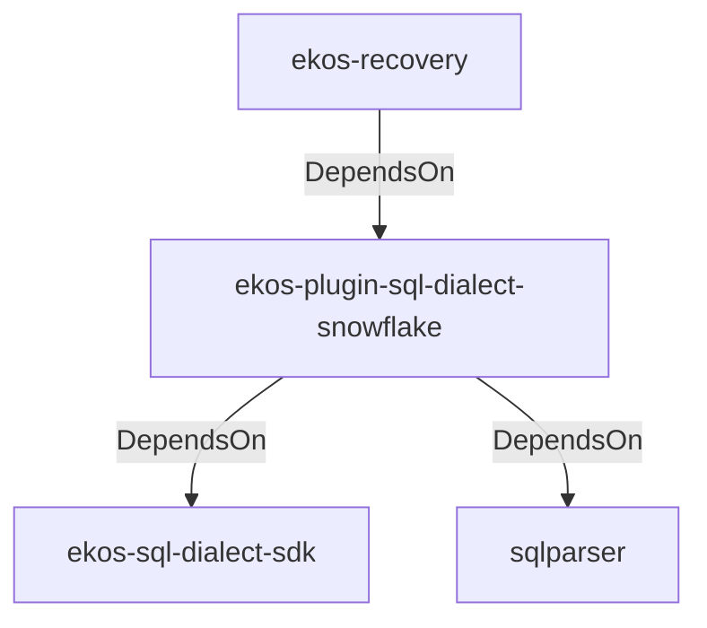

# ekos-plugin-sql-dialect-snowflake (Crate)

## Properties

| Key | Value |
|---|---|
| `description` | Snowflake SqlDialectParser plugin (RFC 0039) |
| `path` | ekos/plugins/sql-dialect-snowflake |

## Relationships

### DependsOn

- ← ekos-recovery (`28244ebb-4e16-5e8d-a637-5e750d01f2b8`) — evidence: ekos-recovery depends on ekos-plugin-sql-dialect-snowflake (path dependency)
- → ekos-sql-dialect-sdk (`bf4371bd-7cee-54d1-9457-06a1079a38cf`) — evidence: ekos-plugin-sql-dialect-snowflake depends on ekos-sql-dialect-sdk (path dependency)
- → sqlparser (`bb72fd94-a6bc-5672-84ef-bdeeb20ad78c`) — evidence: ekos-plugin-sql-dialect-snowflake depends on sqlparser 0.53

## Diagram

## Evidence

- `76b7d1a3-2e2d-4782-bc00-73097981877f` — ekos-recovery depends on ekos-plugin-sql-dialect-snowflake (path dependency) (confidence: 1.00)
- `fe4d1d0f-dd0b-4ac7-8bb4-90bf627cb13a` — ekos-plugin-sql-dialect-snowflake depends on ekos-sql-dialect-sdk (path dependency) (confidence: 1.00)
- `5ce4771a-83b6-4584-ac21-a456bc84ff6b` — ekos-plugin-sql-dialect-snowflake depends on sqlparser 0.53 (confidence: 1.00)
