# ekos-recovery (Crate)

## Properties

| Key | Value |
|---|---|
| `description` | Knowledge Recovery compiler passes: SqlAnalyzer, GitAnalyzer, LLM integration |
| `path` | ekos/crates/recovery |

## Relationships

### DependsOn

- ← ekos-benchmark (`20c26e43-ee96-5ee7-a046-25740fbbd56b`) — evidence: ekos-benchmark depends on ekos-recovery (path dependency)
- ← ekos-runtime (`f4cd2d3b-f0b0-5234-ab2b-39de3275d717`) — evidence: ekos-runtime depends on ekos-recovery (path dependency)
- ← ekos (`abd31cd9-b31d-54c5-87cd-8a4a5b9a30a0`) — evidence: ekos depends on ekos-recovery (path dependency)
- ← ekos-marketing (`18dba45d-9534-5035-bd6f-df6b370079ac`) — evidence: ekos-marketing depends on ekos-recovery (path dependency)
- → anyhow (`0cdec207-5b1a-5831-bd2a-8b57ddb8681c`) — evidence: ekos-recovery depends on anyhow 1
- → async-trait (`7c905290-824b-57e0-a559-15ff1499b4d6`) — evidence: ekos-recovery depends on async-trait 0.1
- → chrono (`0d184cc1-2483-516d-a0b5-0b6bfad54805`) — evidence: ekos-recovery depends on chrono 0.4
- → ekos-artifact (`8806bf54-6364-5052-b85a-cef4344e8f19`) — evidence: ekos-recovery depends on ekos-artifact (path dependency)
- → ekos-common (`dc169f0a-98f1-5c7c-8dd0-1dbc8504e9c9`) — evidence: ekos-recovery depends on ekos-common (path dependency)
- → ekos-compiler-core (`2690bc0d-0233-516f-b969-9e87432f623d`) — evidence: ekos-recovery depends on ekos-compiler-core (path dependency)
- → ekos-kir (`7e3bc0de-d888-55cd-aa9a-f333f6e2cbb2`) — evidence: ekos-recovery depends on ekos-kir (path dependency)
- → ekos-plugin-sql-dialect-databricks (`920f4203-48d4-5079-a5ee-41b212c4858c`) — evidence: ekos-recovery depends on ekos-plugin-sql-dialect-databricks (path dependency)
- → ekos-plugin-sql-dialect-mssql (`05ad9d89-d39c-5316-b413-2903b6b557db`) — evidence: ekos-recovery depends on ekos-plugin-sql-dialect-mssql (path dependency)
- → ekos-plugin-sql-dialect-mysql (`001696e1-9479-5c36-ae53-08898760049d`) — evidence: ekos-recovery depends on ekos-plugin-sql-dialect-mysql (path dependency)
- → ekos-plugin-sql-dialect-postgres (`ff9a3a7c-0610-5442-ac0b-210e45700aad`) — evidence: ekos-recovery depends on ekos-plugin-sql-dialect-postgres (path dependency)
- → ekos-plugin-sql-dialect-snowflake (`15989d49-59f8-564e-a77d-c90d2d87c80b`) — evidence: ekos-recovery depends on ekos-plugin-sql-dialect-snowflake (path dependency)
- → ekos-semantic (`f82d9ce0-df2a-5af8-9f9a-2bd5f8484839`) — evidence: ekos-recovery depends on ekos-semantic (path dependency)
- → ekos-sql-dialect-sdk (`bf4371bd-7cee-54d1-9457-06a1079a38cf`) — evidence: ekos-recovery depends on ekos-sql-dialect-sdk (path dependency)
- → glob (`40efe7e9-ffab-572f-8719-2b126d08d101`) — evidence: ekos-recovery depends on glob 0.3
- → hex (`fa785806-31c3-5308-ae4a-2898a2c181ca`) — evidence: ekos-recovery depends on hex 0.4
- → reqwest (`70acdf50-6295-5f0c-9157-cb9866d0ec23`) — evidence: ekos-recovery depends on reqwest 0.12
- → roxmltree (`2c49c3ee-d872-58b0-90ba-db9d36ad07f5`) — evidence: ekos-recovery depends on roxmltree 0.20
- → rustpython-ast (`9f937ef9-ce54-5794-b264-e087394732af`) — evidence: ekos-recovery depends on rustpython-ast 0.4
- → serde_json (`02548eee-6478-5324-851f-3a6329ccfeca`) — evidence: ekos-recovery depends on serde 1
- → sha2 (`64d6fba9-eea7-52e6-9b3a-b2e887a6944f`) — evidence: ekos-recovery depends on sha2 0.10
- → sqlparser (`bb72fd94-a6bc-5672-84ef-bdeeb20ad78c`) — evidence: ekos-recovery depends on sqlparser 0.53
- → syn (`0c065456-4b3b-5fdd-a8b3-4b83de26d33e`) — evidence: ekos-recovery depends on syn 3.0
- → thiserror (`bbefe8a3-f76e-509f-910b-b439cd7eeff6`) — evidence: ekos-recovery depends on thiserror 2
- → tokio (`4a4e8d5c-5102-5d1d-addd-d7fb0bc8d7b9`) — evidence: ekos-recovery depends on tokio 1
- → toml (`b2678e73-f1ed-50db-8272-d18217301a2a`) — evidence: ekos-recovery depends on toml 0.8
- → tracing (`4282d266-2850-5d04-a992-0f0a204788aa`) — evidence: ekos-recovery depends on tracing 0.1
- → uuid (`ba61f6c0-d160-5eaf-a437-895cee5c72e9`) — evidence: ekos-recovery depends on uuid 1

## Diagram

```mermaid
graph TD
    n28244ebb4e165e8da6375e750d01f2b8["ekos-recovery"]
    n20c26e43ee965ee7a04625740fbbd56b["ekos-benchmark"]
    n20c26e43ee965ee7a04625740fbbd56b -->|DependsOn| n28244ebb4e165e8da6375e750d01f2b8
    nf4cd2d3bf0b05234ab2b39de3275d717["ekos-runtime"]
    nf4cd2d3bf0b05234ab2b39de3275d717 -->|DependsOn| n28244ebb4e165e8da6375e750d01f2b8
    nabd31cd9b31d54c587cd8a4a5b9a30a0["ekos"]
    nabd31cd9b31d54c587cd8a4a5b9a30a0 -->|DependsOn| n28244ebb4e165e8da6375e750d01f2b8
    n18dba45d95345035bd6fdf6b370079ac["ekos-marketing"]
    n18dba45d95345035bd6fdf6b370079ac -->|DependsOn| n28244ebb4e165e8da6375e750d01f2b8
    n0cdec2075b1a5831bd2a8b57ddb8681c["anyhow"]
    n28244ebb4e165e8da6375e750d01f2b8 -->|DependsOn| n0cdec2075b1a5831bd2a8b57ddb8681c
    n7c905290824b57e0a55915ff1499b4d6["async-trait"]
    n28244ebb4e165e8da6375e750d01f2b8 -->|DependsOn| n7c905290824b57e0a55915ff1499b4d6
    n0d184cc12483516da0b50b6bfad54805["chrono"]
    n28244ebb4e165e8da6375e750d01f2b8 -->|DependsOn| n0d184cc12483516da0b50b6bfad54805
    n8806bf5463645052b85acef4344e8f19["ekos-artifact"]
    n28244ebb4e165e8da6375e750d01f2b8 -->|DependsOn| n8806bf5463645052b85acef4344e8f19
    ndc169f0a98f15c7c8dd01dbc8504e9c9["ekos-common"]
    n28244ebb4e165e8da6375e750d01f2b8 -->|DependsOn| ndc169f0a98f15c7c8dd01dbc8504e9c9
    n2690bc0d0233516fb9699e87432f623d["ekos-compiler-core"]
    n28244ebb4e165e8da6375e750d01f2b8 -->|DependsOn| n2690bc0d0233516fb9699e87432f623d
    n7e3bc0ded88855cdaa9af333f6e2cbb2["ekos-kir"]
    n28244ebb4e165e8da6375e750d01f2b8 -->|DependsOn| n7e3bc0ded88855cdaa9af333f6e2cbb2
    n920f420348d45079a5ee41b212c4858c["ekos-plugin-sql-dialect-databricks"]
    n28244ebb4e165e8da6375e750d01f2b8 -->|DependsOn| n920f420348d45079a5ee41b212c4858c
    n05ad9d89d39c5316b4132903b6b557db["ekos-plugin-sql-dialect-mssql"]
    n28244ebb4e165e8da6375e750d01f2b8 -->|DependsOn| n05ad9d89d39c5316b4132903b6b557db
    n001696e194795c36ae5308898760049d["ekos-plugin-sql-dialect-mysql"]
    n28244ebb4e165e8da6375e750d01f2b8 -->|DependsOn| n001696e194795c36ae5308898760049d
    nff9a3a7c06105442ac0b210e45700aad["ekos-plugin-sql-dialect-postgres"]
    n28244ebb4e165e8da6375e750d01f2b8 -->|DependsOn| nff9a3a7c06105442ac0b210e45700aad
    n15989d4959f8564ea77dc90d2d87c80b["ekos-plugin-sql-dialect-snowflake"]
    n28244ebb4e165e8da6375e750d01f2b8 -->|DependsOn| n15989d4959f8564ea77dc90d2d87c80b
    nf82d9ce0df2a5af89f9a2bd5f8484839["ekos-semantic"]
    n28244ebb4e165e8da6375e750d01f2b8 -->|DependsOn| nf82d9ce0df2a5af89f9a2bd5f8484839
    nbf4371bd7cee54d1945706a1079a38cf["ekos-sql-dialect-sdk"]
    n28244ebb4e165e8da6375e750d01f2b8 -->|DependsOn| nbf4371bd7cee54d1945706a1079a38cf
    n40efe7e9ffab572f87192b126d08d101["glob"]
    n28244ebb4e165e8da6375e750d01f2b8 -->|DependsOn| n40efe7e9ffab572f87192b126d08d101
    nfa78580631c35308ae4a2898a2c181ca["hex"]
    n28244ebb4e165e8da6375e750d01f2b8 -->|DependsOn| nfa78580631c35308ae4a2898a2c181ca
    n70acdf5062955f0c9157cb9866d0ec23["reqwest"]
    n28244ebb4e165e8da6375e750d01f2b8 -->|DependsOn| n70acdf5062955f0c9157cb9866d0ec23
    n2c49c3eed87258b090badb9d36ad07f5["roxmltree"]
    n28244ebb4e165e8da6375e750d01f2b8 -->|DependsOn| n2c49c3eed87258b090badb9d36ad07f5
    n9f937ef9ce545794b264e087394732af["rustpython-ast"]
    n28244ebb4e165e8da6375e750d01f2b8 -->|DependsOn| n9f937ef9ce545794b264e087394732af
    n02548eee64785324851f3a6329ccfeca["serde_json"]
    n28244ebb4e165e8da6375e750d01f2b8 -->|DependsOn| n02548eee64785324851f3a6329ccfeca
    n64d6fba9eea752e69b3ab2e887a6944f["sha2"]
    n28244ebb4e165e8da6375e750d01f2b8 -->|DependsOn| n64d6fba9eea752e69b3ab2e887a6944f
    nbb72fd94a6bc567284efbdeeb20ad78c["sqlparser"]
    n28244ebb4e165e8da6375e750d01f2b8 -->|DependsOn| nbb72fd94a6bc567284efbdeeb20ad78c
    n0c0654564b3b5fdda8b34b83de26d33e["syn"]
    n28244ebb4e165e8da6375e750d01f2b8 -->|DependsOn| n0c0654564b3b5fdda8b34b83de26d33e
    nbbefe8a3f76e509f910bb439cd7eeff6["thiserror"]
    n28244ebb4e165e8da6375e750d01f2b8 -->|DependsOn| nbbefe8a3f76e509f910bb439cd7eeff6
    n4a4e8d5c51025d1dadddd7fb0bc8d7b9["tokio"]
    n28244ebb4e165e8da6375e750d01f2b8 -->|DependsOn| n4a4e8d5c51025d1dadddd7fb0bc8d7b9
    nb2678e73f1ed50db8272d18217301a2a["toml"]
    n28244ebb4e165e8da6375e750d01f2b8 -->|DependsOn| nb2678e73f1ed50db8272d18217301a2a
    n4282d26628505d04a9920f0a204788aa["tracing"]
    n28244ebb4e165e8da6375e750d01f2b8 -->|DependsOn| n4282d26628505d04a9920f0a204788aa
    nba61f6c0d1605eafa437895cee5c72e9["uuid"]
    n28244ebb4e165e8da6375e750d01f2b8 -->|DependsOn| nba61f6c0d1605eafa437895cee5c72e9
```

## Evidence

- `6d8df50c-dd29-452f-9a64-9cdf671da2a8` — ekos-benchmark depends on ekos-recovery (path dependency) (confidence: 1.00)
- `ca4400da-25c4-4cfb-ad89-41bea9b52b77` — ekos-runtime depends on ekos-recovery (path dependency) (confidence: 1.00)
- `2bab58e8-c4e0-46b7-bd01-e407066ef9e2` — ekos depends on ekos-recovery (path dependency) (confidence: 1.00)
- `e8657c08-16e1-462e-9cf0-795508bbe754` — ekos-marketing depends on ekos-recovery (path dependency) (confidence: 1.00)
- `d0a34d00-2f96-4615-a251-3537f913388a` — ekos-recovery depends on anyhow 1 (confidence: 1.00)
- `7459f90c-2b1b-4823-98ce-1dc48c80efb1` — ekos-recovery depends on async-trait 0.1 (confidence: 1.00)
- `3bf8e46a-2d7c-4342-98d0-666b8acf39f7` — ekos-recovery depends on chrono 0.4 (confidence: 1.00)
- `64db8f3c-fe0b-4cfb-b19e-083ae9de2fec` — ekos-recovery depends on ekos-artifact (path dependency) (confidence: 1.00)
- `dc207ae8-55a4-4946-a8a0-91c8892e25e7` — ekos-recovery depends on ekos-common (path dependency) (confidence: 1.00)
- `d8a9fded-dbd9-46c2-b840-fa088e92b0a5` — ekos-recovery depends on ekos-compiler-core (path dependency) (confidence: 1.00)
- `c909d073-d12c-4714-837e-91a81085ca84` — ekos-recovery depends on ekos-kir (path dependency) (confidence: 1.00)
- `4355cf7d-96c3-48bf-8b02-86beae0a2694` — ekos-recovery depends on ekos-plugin-sql-dialect-databricks (path dependency) (confidence: 1.00)
- `583f5e11-9a66-49a7-82ce-7292698f577a` — ekos-recovery depends on ekos-plugin-sql-dialect-mssql (path dependency) (confidence: 1.00)
- `afd606fb-6783-4a18-b847-6f3ba4610fa6` — ekos-recovery depends on ekos-plugin-sql-dialect-mysql (path dependency) (confidence: 1.00)
- `8dce1dcc-d9ad-453f-98ba-b59444b521fc` — ekos-recovery depends on ekos-plugin-sql-dialect-postgres (path dependency) (confidence: 1.00)
- `76b7d1a3-2e2d-4782-bc00-73097981877f` — ekos-recovery depends on ekos-plugin-sql-dialect-snowflake (path dependency) (confidence: 1.00)
- `6222ffaf-0679-4a9a-9214-bfea0a439042` — ekos-recovery depends on ekos-semantic (path dependency) (confidence: 1.00)
- `8d407b28-bcb4-49b5-b705-4669c07d90f0` — ekos-recovery depends on ekos-sql-dialect-sdk (path dependency) (confidence: 1.00)
- `8d16741f-b8a0-4bbd-8493-85a5eec0ce18` — ekos-recovery depends on glob 0.3 (confidence: 1.00)
- `5366644e-1ac3-44cd-a0e1-9e2126242f07` — ekos-recovery depends on hex 0.4 (confidence: 1.00)
- `b8e228e9-6f95-420e-964f-15a4aabab58e` — ekos-recovery depends on reqwest 0.12 (confidence: 1.00)
- `c7b7ce68-ffb3-42e6-8e33-d063794f29ac` — ekos-recovery depends on roxmltree 0.20 (confidence: 1.00)
- `a1973af9-ff81-4c38-a61a-ed8096ae7a9b` — ekos-recovery depends on rustpython-ast 0.4 (confidence: 1.00)
- `82c14887-2207-494e-a6e6-a377f30aaa01` — ekos-recovery depends on rustpython-parser 0.4 (confidence: 1.00)
- `18a46988-fece-4582-a611-052140eaed9e` — ekos-recovery depends on serde 1 (confidence: 1.00)
- `1426d430-f87e-46e0-a1c4-6982f788ab4c` — ekos-recovery depends on serde_json 1 (confidence: 1.00)
- `732e40ae-20fc-41dd-b9fc-ca0c2f240971` — ekos-recovery depends on serde_yaml 0.9 (confidence: 1.00)
- `6ba66a9f-93ff-4a05-a0d3-a7adf0395f42` — ekos-recovery depends on sha2 0.10 (confidence: 1.00)
- `15cecb9c-c7eb-489c-b3d1-dd6410815e3a` — ekos-recovery depends on sqlparser 0.53 (confidence: 1.00)
- `9bb50a6a-bd72-434f-9c19-3cc5c883d34a` — ekos-recovery depends on syn 3.0 (confidence: 1.00)
- `9be4fbf4-8fe9-4b38-bef2-0fb8583e8b38` — ekos-recovery depends on thiserror 2 (confidence: 1.00)
- `94eb17f1-61df-4a6c-815f-4f6b88be3514` — ekos-recovery depends on tokio 1 (confidence: 1.00)
- `96556c19-5bc2-4a2b-bba6-4180e555a7ca` — ekos-recovery depends on toml 0.8 (confidence: 1.00)
- `b0cf3608-09a4-4eb2-8de1-dac30e874316` — ekos-recovery depends on tracing 0.1 (confidence: 1.00)
- `0ff45d77-e419-4938-9273-8f0246582c87` — ekos-recovery depends on uuid 1 (confidence: 1.00)
