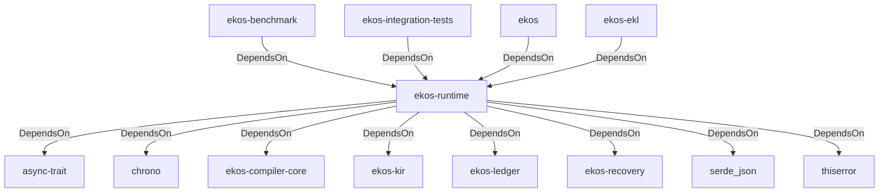

# ekos-runtime (Crate)

## Properties

| Key | Value |
|---|---|
| `description` | Read-only state reconstruction from the ledger |
| `path` | ekos/crates/runtime |

## Relationships

### DependsOn

- ← ekos-benchmark (`20c26e43-ee96-5ee7-a046-25740fbbd56b`) — evidence: ekos-benchmark depends on ekos-runtime (path dependency)
- ← ekos-integration-tests (`063808f9-5f19-5d62-b3dd-69eaa93d44cb`) — evidence: ekos-integration-tests depends on ekos-runtime (path dependency)
- → async-trait (`7c905290-824b-57e0-a559-15ff1499b4d6`) — evidence: ekos-runtime depends on async-trait 0.1
- → chrono (`0d184cc1-2483-516d-a0b5-0b6bfad54805`) — evidence: ekos-runtime depends on chrono 0.4
- → ekos-compiler-core (`2690bc0d-0233-516f-b969-9e87432f623d`) — evidence: ekos-runtime depends on ekos-compiler-core (path dependency)
- → ekos-kir (`7e3bc0de-d888-55cd-aa9a-f333f6e2cbb2`) — evidence: ekos-runtime depends on ekos-kir (path dependency)
- → ekos-ledger (`9c977335-c421-519c-a889-558f0487574e`) — evidence: ekos-runtime depends on ekos-ledger (path dependency)
- → ekos-recovery (`28244ebb-4e16-5e8d-a637-5e750d01f2b8`) — evidence: ekos-runtime depends on ekos-recovery (path dependency)
- → serde_json (`02548eee-6478-5324-851f-3a6329ccfeca`) — evidence: ekos-runtime depends on serde 1
- → thiserror (`bbefe8a3-f76e-509f-910b-b439cd7eeff6`) — evidence: ekos-runtime depends on thiserror 2
- ← ekos (`abd31cd9-b31d-54c5-87cd-8a4a5b9a30a0`) — evidence: ekos depends on ekos-runtime (path dependency)
- ← ekos-ekl (`d932eaf4-7069-5419-a00c-fa4b7b374c86`) — evidence: ekos-ekl depends on ekos-runtime (path dependency)

## Diagram

## Evidence

- `e5e925ec-a365-406f-80de-b6ee1f3e3db1` — ekos-benchmark depends on ekos-runtime (path dependency) (confidence: 1.00)
- `44372c29-7bde-4b90-ab96-3da94dc319c9` — ekos-integration-tests depends on ekos-runtime (path dependency) (confidence: 1.00)
- `2daeea6e-5d53-47bf-bc96-31d658f9af06` — ekos-runtime depends on async-trait 0.1 (confidence: 1.00)
- `adb6d5f6-bab2-486d-a6e1-93c2856732fd` — ekos-runtime depends on chrono 0.4 (confidence: 1.00)
- `acdd8d7f-77fe-4eb1-921b-0546461b16a0` — ekos-runtime depends on ekos-compiler-core (path dependency) (confidence: 1.00)
- `eeb2cb7a-9438-4eb2-adfd-3996316a8d62` — ekos-runtime depends on ekos-kir (path dependency) (confidence: 1.00)
- `c5e270bf-1a7e-4af6-b7aa-ca398bb4ac4e` — ekos-runtime depends on ekos-ledger (path dependency) (confidence: 1.00)
- `ca4400da-25c4-4cfb-ad89-41bea9b52b77` — ekos-runtime depends on ekos-recovery (path dependency) (confidence: 1.00)
- `5db75a6e-dda8-408a-afe3-3041552d3b8f` — ekos-runtime depends on serde 1 (confidence: 1.00)
- `feafd1e2-175b-4d49-a447-5a53bfccd7d3` — ekos-runtime depends on serde_json 1 (confidence: 1.00)
- `6ba5ce63-ed7b-431b-b127-8f25cdcc20b5` — ekos-runtime depends on thiserror 2 (confidence: 1.00)
- `b3bebde7-1849-4220-b91d-18cb38c38474` — ekos depends on ekos-runtime (path dependency) (confidence: 1.00)
- `3a2ab01e-87fc-476f-9bee-a4fc0da62dd7` — ekos-ekl depends on ekos-runtime (path dependency) (confidence: 1.00)
